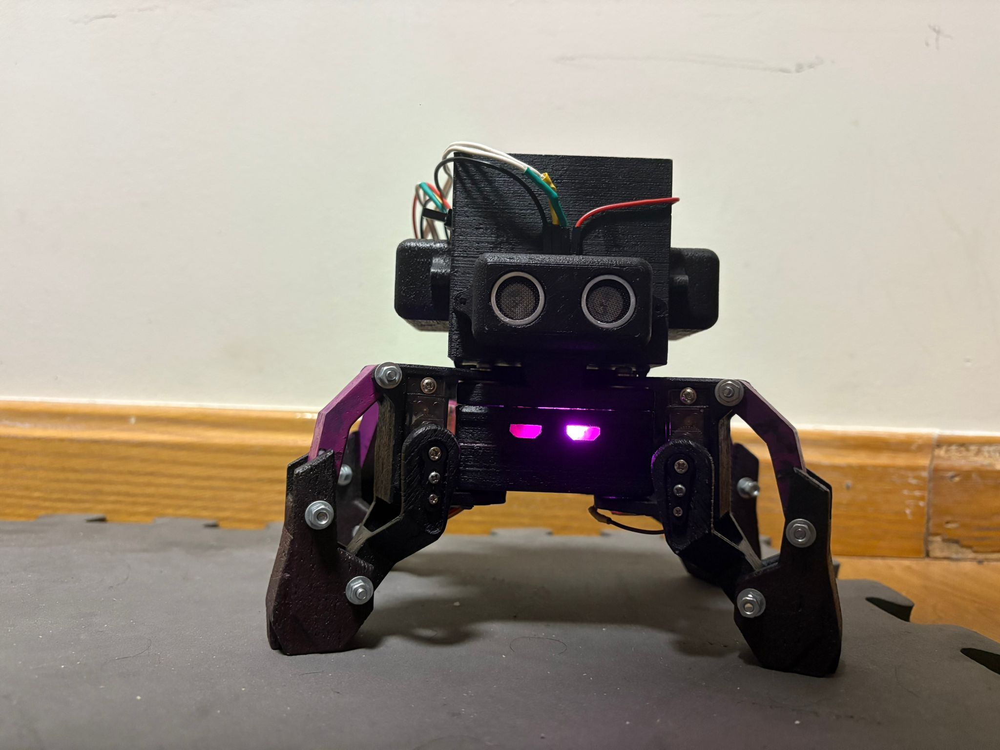

# Robot Brutus

This repository contains the final project for the Mechatronics course, part of the Degree in Software Robotics Engineering at the Rey Juan Carlos University.

**Authors:** Sergio Sanchez Hernandez, Jorge Barroso Saugar, Sergio Cobos Blanco

What can you find in this repository:
- [Technical report](./docs/brutus_technical_report.pdf)
- [User and mantainance manual](./docs/user_and_mantainance_manual.md)
- [Meshes of the pieces](./meshes/)
- [Code](./src/brutus_esp32)
- [Brutus' MQTT user interfaces](./mqtt_interface/)
- [Doxygen index of the code](https://sons-of-brutus.github.io/Robot_Brutus/)