# User and mantainance manual

---

## Table of content

This document is divided into the following sections:

1. [Mantainance manual](#mantainance-manual)
2. [Robot Components Overview](#robot-components-overview)
3. [Materials](#materials)
   1. [Printable pieces](#printable-pieces)
   2. [Electronic components](#electronic-components)
   3. [Wiring](#wiring)
   4. [Fasteners](#fasteners)
4. [Assembly](#assembly)
   1. [Soldering `ESP32` and `PCA9685` Connections](#1-soldering-esp32-and-pca9685-connections)
   2. [Assembling chasis (Part 1)](#2-assembling-chasis-part-1)
   3. [Assembling legs (Part 1)](#3-assembling-legs-part-1)
   4. [Connecting servos to `PCA9685`](#4-connecting-servos-to-pca9685)
   5. [Assembling chasis (Part 2)](#5-assembling-chasis-part-2)
   6. [Joining legs with chasis](#6-joining-legs-with-chasis)
   7. [Assembling upper box](#7-assembling-upper-box)
   8. [Joining upper box with chasis](#8-joining-upper-box-with-chasis)
   9. [Assembling legs (Part 2)](#9-assembling-legs-part-2)
5. [Mechanical Maintenance](#mechanical-maintenance)
   1. [Fasteners and Joint Inspection](#fasteners-and-joint-inspection)
   2. [Bearing Condition](#bearing-condition)
   3. [Servo Mounting and Horns](#servo-mounting-and-horns)
   4. [Printed Part Inspection](#printed-part-inspection)
6. [Battery Maintenance and Safety](#battery-maintenance-and-safety)
   1. [Voltage limits](#voltage-limits)
   2. [Storage recommendations](#storage-recommendations)
7. [Electrical Connections and Wiring Integrity](#electrical-connections-and-wiring-integrity)
   1. [Critical power cables](#critical-power-cables)
   2. [Connections most likely to cause power loss](#connections-most-likely-to-cause-power-loss)
   3. [Detecting bad contacts](#detecting-bad-contacts)
   4. [Ultrasonic sensor cables](#ultrasonic-sensor-cables)
8. [User Manual](#user-manual)
   1. [Network and MQTT configuration](#network-and-mqtt-configuration)
   2. [WiFi configuration](#wifi-configuration)
   3. [MQTT configuration](#mqtt-configuration)
9. [`brutus_params.h` – Robot configuration and motion parameters](#brutus_paramsh--robot-configuration-and-motion-parameters)
10. [`comms_params.h` – MQTT communication configuration](#comms_paramsh--mqtt-communication-configuration)
11. [User Sketch](#user-sketch)
12. [Logic Task Definition](#logic-task-definition)
13. [Doxygen](#doxygen)


---

# Mantainance manual

This document describes the recommended maintenance procedures for the Brutus quadruped robot.  
Its purpose is to ensure long-term reliability, safety, and performance by defining how the mechanical, electrical, and structural components should be inspected, cleaned, and replaced over time.

Brutus is a multi-servo quadruped robot built from 3D-printed structural parts, metal fasteners, electronic modules, and a Li-ion power system. Due to the presence of moving joints, electrical power distribution, and lithium batteries, proper maintenance is essential to prevent premature wear, electrical failures, and unsafe operating conditions.

This manual is based on:
- The mechanical assembly guide  
- The list of printed and electronic components  
- The electrical schematic (KiCad)  
- The battery and power system design  

It is intended for:
- Regular users performing routine checks  
- Developers modifying or upgrading the robot  
- Anyone disassembling and reassembling this robot  

The procedures described here allow safe servicing without damaging the robot.

---

## Robot Components Overview

Before performing any maintenance, inspection, or repair on Brutus, it is essential to understand the physical and electronic components that make up the robot.

This section provides a complete overview of all structural, mechanical, and electronic elements used in Brutus. Knowing the location, function, and role of each part allows safe and efficient troubleshooting, replacement, and upgrades.

---

## Materials

### Printable pieces
| Name | Quantity | Mesh | Image |
| :--- | :---: | :---: | ---: |
| `Chasis` | 1 | [chasis_mesh.stl](../meshes/chasis_mesh.stl) | 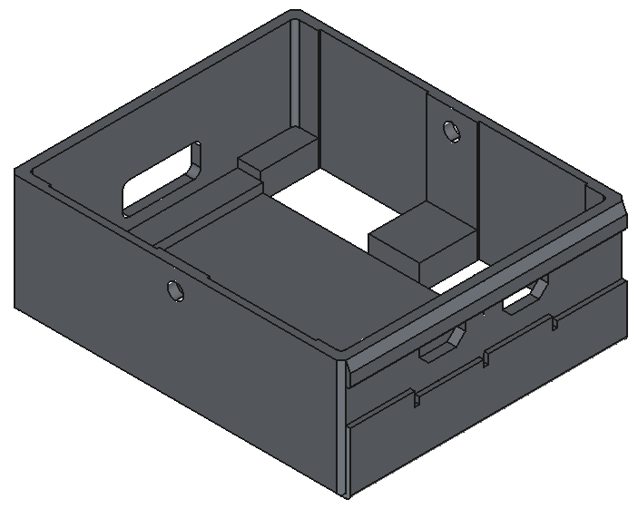 |
| `Chasis cover` | 1 | [chasis_cover_mesh.stl](../meshes/chasis_cover_mesh.stl) |  |
| `Spacer` (optional) | 4 | [spacer.stl](../meshes/spacer.png) | 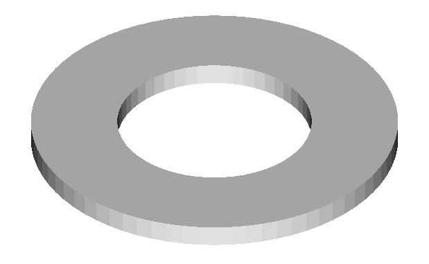 |
| `Left shoulder` | 2 | [left_shoulder_mesh.stl](../meshes/left_shoulder_mesh.stl) | 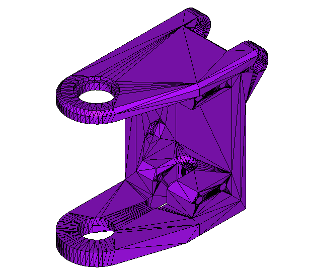 |
| `Right shoulder` | 2 | [right_shoulder_mesh.stl](../meshes/right_shoulder_mesh.stl) |  |
| `Left elbow` | 2 | [left_elbow_mesh.stl](../meshes/left_elbow_mesh.stl) | 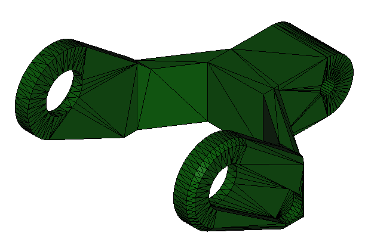 |
| `Right elbow` | 2 | [right_elbow_mesh.stl](../meshes/right_elbow_mesh.stl) | 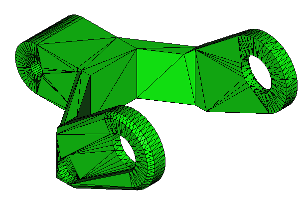 |
| `Leg up link` | 4 | [leg_up_link_mesh.stl](../meshes/leg_up_link_mesh.stl) |  |
| `Foot` | 4 | [foot_fist_mesh.stl](../meshes/foot_fist_mesh.stl) |  | 
| `Up box` | 1 | [up_box_mesh.stl](../meshes/up_box_mesh.stl) | 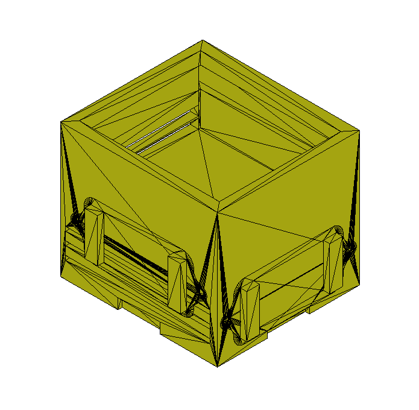 |
| `US Sensor chasis` | 3 | [us_chasis_mesh.stl](../meshes/us_chasis_mesh.stl) |  |
| `Battery limit` | 1 | [battery_limit.stl](../meshes/battery_limit.stl) |  |
| `Weight case` | 1 | [weight_case.stl](../meshes/weight_case.stl) | 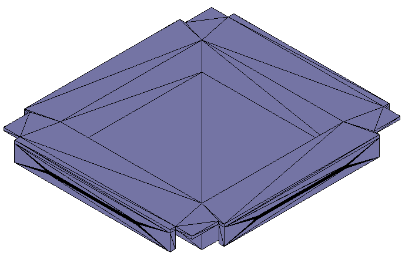 |

**Notes:**
- ***Left shoulder/elbow** are for **front left** leg and **back right** leg, while **right shoulder/elbow** are for **front right** leg, **back left** leg.*
- *Spacer is optional as you can replace it for M3 metalic washers with similar dimensions.*

### Electronic components
| Name | Quantity | Description | Link | Image |
| :--- | :---: | :---: | :---: | ---: |
| `ESP32` development board | 1 | Dual-Core microcontroller with integrated WiFi and Bluetooth | [Link](https://www.amazon.es/AZDelivery-ESP-32-Dev-Kit-Development/dp/B0DJ33NNRD?) |  |
| `PCA9685` | 1 | 16-channel, I2C-controlled PWM (Pulse Width Modulation) controller. For servos control. | [Link](https://es.aliexpress.com/item/1005005670283526.html) |  |
| `DC-DC Buck module` | 1 | Ultra-small 10A DC-DC Buck Converter 9V-14V to 5V Step-Down Voltage Regulator Module. | [Link](https://es.aliexpress.com/item/1005009068963636.html?) |  |
| `MG90S Servo` | 8 | High-torque, metal-gear micro servo motor. | [Link](https://es.aliexpress.com/item/1005007522665750.html?) |  |
| `Battery` | 1 | 3S1P 18650 Lithium-ion Battery Packs, 12V Rechargeable Lithium Battery.  | [Link](https://es.aliexpress.com/item/1005009656713743.html?) | 
| `HC-SR04` | 3 | Ultrasonic distance sensor | [Link](https://es.aliexpress.com/item/1005010356855481.html?) |  |
| `RGB LED` | 1 | RGB flat led module | Not specified |  |
| `Switch` | 1 | Electronic switch (as small as you can) | Not specified | Not specified |

### Wiring

**Important**: Some wire lengths are redundant.

| Name | Quantity/Length | Image |
| :--- | :----: | ---: |
| `2-Pole Terminal Block` | 1 |  |
| `16 AWG Wire` | 500 mm aprox. | - |
| `20 AWG Wire` | 500 mm aprox. | - |
| `26 AWG Wire` | 500 mm aprox. | - |
| `28 AWG Wire` | 200 mm aprox. | - |
| `Female-to-female jumper wire` | 18 | 

**Notes**:
- `2-Pole Terminal` can be substituted by:
  + Using 2 `1-Pole Terminal Block`.
  + Cutting a `N-pole Terminal Block` with more than 2 poles.
- You can substitute 28 AWG cables by using *jumper wires* with their conectors removed.
- Wire gauges:


### Fasteners


| Name | Details | Quantity | Image |
| :--- | :--- | :---: | ---: |
| `Bearing` | F693ZZ Bearing | 8 | 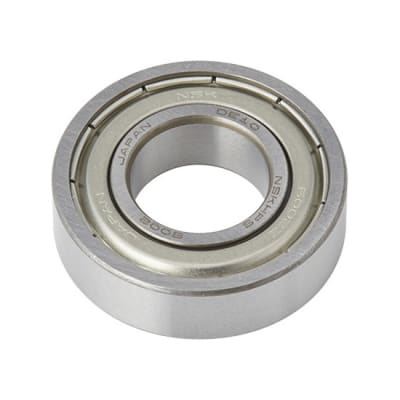 |
| `M3x30mm Bolt` | M3 30mm hex bolt | 12 |  |
| `M3 Nut` | Standard M3 hex nut (used in legs + top cover) | 30 | |
| `M3 Washer` | M3 metal washer | 16 |  |
| `M1 Screw` | M1 self-tapping screw (servo horn screws + ESP top cover mount) | 10 |  |
| `M2 Screw` | M2 screw (mounting servos, 2 per servo × 4 servos) | 8 |  |


---

## Assembly
Naw we are going to describe the complete mechanical and electrical assembly process of the Brutus quadruped robot.  
It provides step-by-step instructions for building the robot starting from individual electronic boards, servos, and 3D-printed parts up to a fully assembled and operational system.

The assembly process combines:
- Mechanical construction using 3D-printed structural components
- Electrical wiring and soldering of the control electronics
- Power distribution through a regulated battery system
- Integration of sensors, actuators, and control boards

This manual assumes that the user has:
- Basic experience with soldering and electronics
- Access to common tools (screwdrivers, soldering iron, cutters, etc.)
- The printed parts and electronic components listed in the Materials section

Once assembled, the robot should match the mechanical and electrical configuration used during simulation and software development, ensuring that calibration, control, and power limits behave as expected.

---

This assembly instructions are divided in N parts:
1. [Soldering `ESP32` Connections](#1-soldering-esp32-connections)
2. [Assembling chasis (Part 1)](#2-assembling-chasis-part-1)
3. [Assembling legs (Part 1)](#3-assembling-legs-part-1)
4. [Connecting servos to `PCA9685`](#4-connecting-servos-to-pca9685)
5. [Assembling chasis (Part 2)](#5-assembling-chasis-part-2)
6. [Joining legs with chasis](#6-joining-legs-with-chasis)
7. [Assembling upper box](#7-assembling-upper-box)
8. [Joining upper box with chasis](#8-joining-upper-box-with-chasis)
9. [Assembling legs (Part 2)](#9-assembling-legs-part-2)

---
### 1. Soldering `ESP32` and `PCA9685` Connections

First of all, if your `ESP32` and/or `PCA9685` have soldered pins, first, you should desolder them, so the pin's holes for the upcoming cables are free.

Following the [electronics schematics image](../electronics/brutus_schematic/brutus_electronic_schematics.svg) (<-- Click here to see it bigger):


**Important**: Below the table there are important considerations you must take in account while soldering.

Solder the following connections:
| PIN 1 | PIN 2 | Wire | Details |
| :--- | :---: | :---: | ---: |
| `ESP32` Vin or 5V | *Nowhere* | 26 AWG | Leave a relatively large quantity of wire as it will be connected to the `2-Pole Terminal Block` at the upper box. Continued at "[Joining upper box with chasis](#joining-upper-box-with-chasis)" steps. |
| `ESP32` GND | *Nowhere* | 26 AWG | Leave a relatively large quantity of wire as it will be connected to the `2-Pole Terminal Block` at the upper box. Continued at "[Joining upper box with chasis](#joining-upper-box-with-chasis)" steps. |
| `PCA9685` V+ | *Nowhere* | 20 AWG | Leave a relatively large quantity of wire as it will be connected to the `2-Pole Terminal Block` at the upper box. Continued at "[Joining upper box with chasis](#joining-upper-box-with-chasis)" steps. |
| `PCA9685` GND | *Nowhere* | 20 AWG | Leave a relatively large quantity of wire as it will be connected to the `2-Pole Terminal Block` at the upper box. Continued at "[Joining upper box with chasis](#joining-upper-box-with-chasis)" steps. |
| `PCA9685` VCC | `ESP32` 3.3V | 28 AWG | - |
| `PCA9685` SCL | `ESP32` GPIO 22 | 28 AWG | It is **ESSENTIAL** that this connection doesn't change, `PCA9685`'s SCL needs to be connected to `ESP32`'s GPIO 22 |
| `PCA9685` SDA | `ESP32` GPIO 21 | 28 AWG | It is **ESSENTIAL** that this connection doesn't change, `PCA9685`'s SCL needs to be connected to `ESP32`'s GPIO 22 |
| `PCA9685` OE | `ESP32` GPIO 19 | 28 AWG | - |
| `RGB LED` R | `ESP32` GPIO 32 | 28 AWG | - |
| `RGB LED` G | `ESP32` GPIO 25 | 28 AWG | - |
| `RGB LED` B | `ESP32` GPIO 33 | 28 AWG | - |
| `RGB LED` GND | `ESP32` GND | 28 AWG | **VERY IMPORTANT!** This `ESP32` GND pin must not be the same as the one in the 2nd row of this table. |
| `ESP32` GPIO 2 | *Nowhere* | Female-to-female jumper | Cut and strip one of the ends of the wire. It needs a relatively large quantity of wire as it will be connected to one of the `HC-SR04` at the upper box. Connections at "[Joining upper box with chasis](#joining-upper-box-with-chasis)" steps. |
| `ESP32` GPIO 15 | *Nowhere* | Female-to-female jumper | The same as `ESP32` GPIO 2 |
| `ESP32` GPIO 16 | *Nowhere* | Female-to-female jumper | The same as `ESP32` GPIO 2 |
| `ESP32` GPIO 4 | *Nowhere* | Female-to-female jumper | The same as `ESP32` GPIO 2 |
| `ESP32` GPIO 17 | *Nowhere* | Female-to-female jumper | The same as `ESP32` GPIO 2 |
| `ESP32` GPIO 5 | *Nowhere* | Female-to-female jumper | The same as `ESP32` GPIO 2 |

**Considerations:**
- The wires for the 4 connections between `ESP32` and `PCA9685` should be *long enough* to allow the `chasis cover` to be separated slightly from the `chasis` when it is open, but *short enough* to avoid taking up excess space when closed.
- The 4 wires that connect `RGB LED` and `ESP32` should be long enough to place this two components as explained in "[Assembling chasis (Part 2)](#assembling-chasis-part-2)" steps.
- For each of the 6 wires for `HC-SR04`, you must remove one of the tips of a `Female-to-female jumper`. The removed part is the one soldered to the `ESP32` and the *female* part will be connected to the `HC-SR04`.

---
### 2. Assembling chasis (Part 1)

#### 2.1. `PCA9685` attachment in the chasis
Put the `PCA9685` in the space at the bottom center of the `chasis` as it is placed in the image:

<p align="center">
  
</p>

#### 2.2. Trim the servo wires to fit
All 8 servos will have shorter wires, but in this step we will only consider the 4 servos inside the chasis.

1. Estimate the length of the servo wire. (At least enough to fit in the chasis)
```
 -------            Wire (PWM, GND, VCC)             -----------
|       |-------------------------------------------|           |
| Servo |-------------------------------------------| Connector |
|       |-------------------------------------------|           |
 -------                                             -----------
              |_____________________________|
                        📏 (Excess)

```
2. Cut out the excess section of wire estimated in the previous step.
```
 -------                    Excess Wire                    -----------
|       |------✂️ ---------------------------- ✂️---------|           |
| Servo |------✂️ ---------------------------- ✂️---------| Connector |
|       |------✂️ ---------------------------- ✂️---------|           |
 -------                                                   -----------
```
3. Now solder the servo-side wires to the connector-side wires.
```
 -------                  -----------
|       |-------🧑‍🏭-------|           |
| Servo |-------🧑‍🏭-------| Connector |
|       |-------🧑‍🏭-------|           |
 -------                  -----------
```

#### 2.3. Place the servos in the chasis

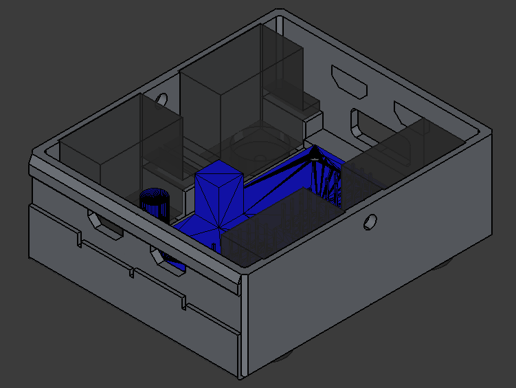

You can use the `sheet metal screws` that are included with the servos to attach the servos to the chasis.

---
### 3. Assembling legs (Part 1)

The images are using `Left shoulder` and `Left elbow` pieces, but the same process is applied to `Right shoulder` and `Right elbow`.

#### 3.1. Attach the servo to the shoulder


You can use the `sheet metal screws` that are included with the servos to attach the servo to the shoulder.

**Important:** You should do the [same process off trimming the servo's wires](#22-trim-the-servo-wires-to-fit) so they could enter to the chasis and be connected to the `PCA9685`, letting some length for shoulder movement.

<p align="center">
  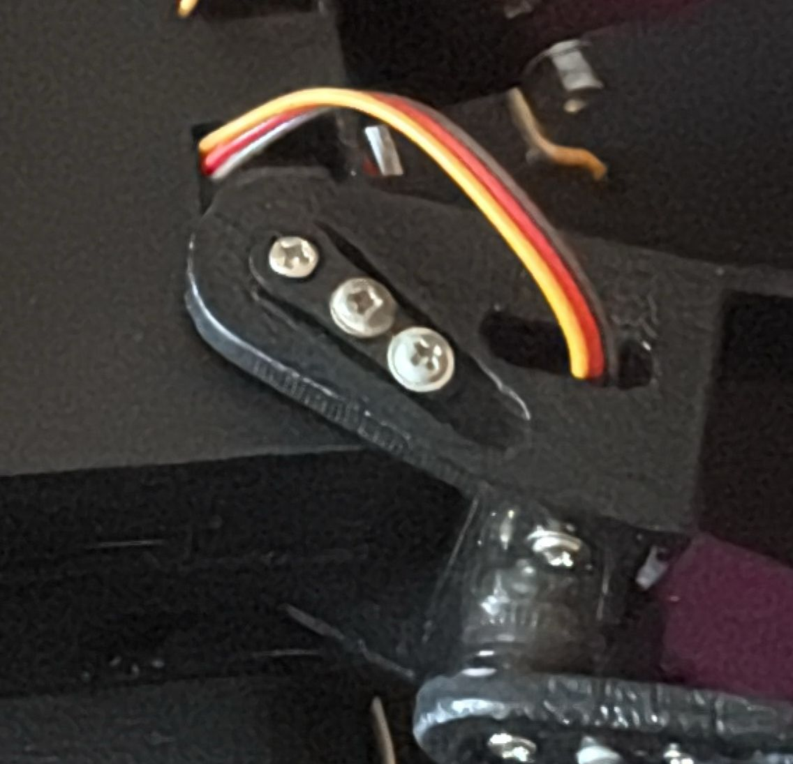
</p>

#### 3.2. Join the elbow and the shoulder

First, identify how you should place de elbow.

<p align="center">
  
  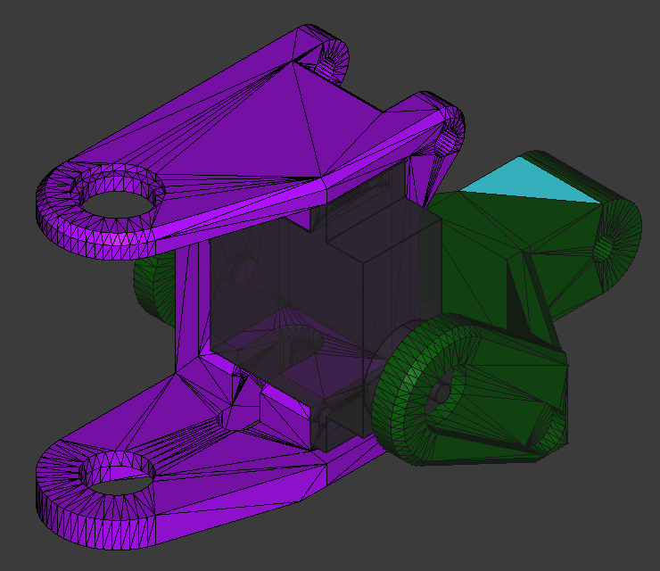
</p>

Then, insert a `M3 nut` into the corresponding slot on the shoulder.

<p align="center">
  
</p>

Finally, screw the elbow to the shoulder as shown, from the non-servo side.


The servo-side will be attached in [part 9](#9-assembling-legs-part-2s).

#### 3.3. Join the `leg up link` and the shoulder

Use `M3x30mm bolt` and `M3 nut`.

<p align="center">
  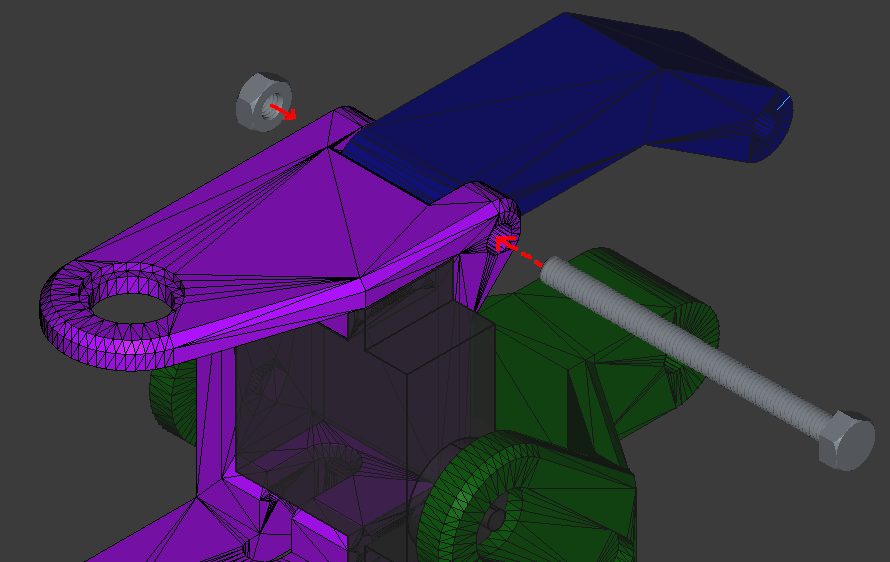
</p>

### 3.4. Add the foot

Use `M3x30mm bolts` and a `M3 nuts`.

<p align="center">
  
</p>

### 3.5. Right vs Left
**REMEMBER:** *Left shoulder/elbow* are for *front left* leg and *back right* leg, while *right shoulder/elbow* are for *front right* leg and *back left* leg.

<p align="center">
  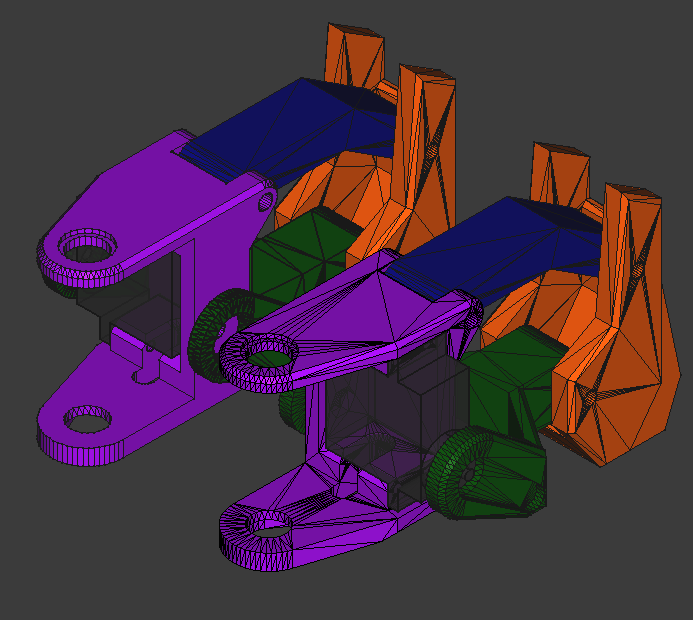
</p>

<p align="center">
  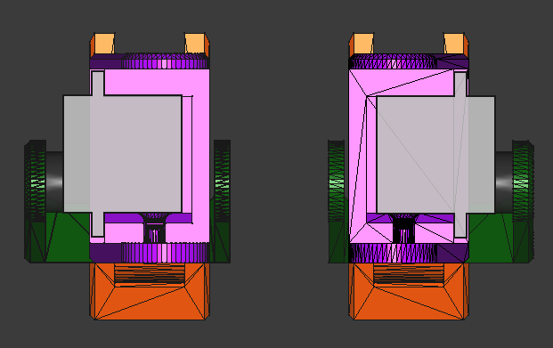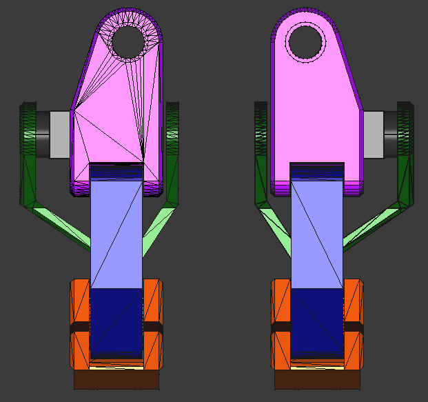
</p>

---
## 4. Connecting servos to `PCA9685`

Now you should connect the 8 `servos` to the `PCA9685` following the  [schematic](../electronics/brutus_schematic/brutus_electronic_schematics.svg) (<-- Click here to see it bigger):


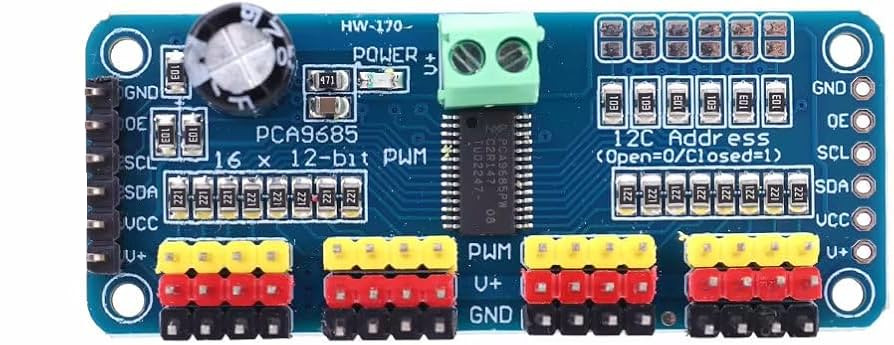

```
      0 ---------------------------> 15
```

| Joint | `PCA9685`'s pin |
| :--- | ---: |
| Front Right Shoulder | 13 |
| Front Right Elbow | 12 |
| Front Left Shoulder | 9 |
| Front Left Elbow | 8 |
| Back Right Shoulder | 2 |
| Back Right Elbow | 3 |
| Back Left Shoulder | 0 |
| Back Left Elbow | 1 |

**Please note**, the following wires (from [part 1](#1-soldering-esp32-and-pca9685-connections)) inside the chassis must be routed out through the rear hole:
+ `ESP32` Vin or 5V
+ `ESP32` GND
+ `PCA9685` V+
+ `PCA9685` GND
+ `ESP32` GPIO 2
+ `ESP32` GPIO 15
+ `ESP32` GPIO 16
+ `ESP32` GPIO 4
+ `ESP32` GPIO 17
+ `ESP32` GPIO 5

---
### 5. Assembling chasis (Part 2)

#### 5.1. Attach the `ESP32` and the `RGB LED` to the `chasis cover`

<p align="center">
  
</p>

#### 5.2. `Chasis cover` M3 nuts

You should place 6 M3 nuts in their corresponding slots:

<p align="center">
  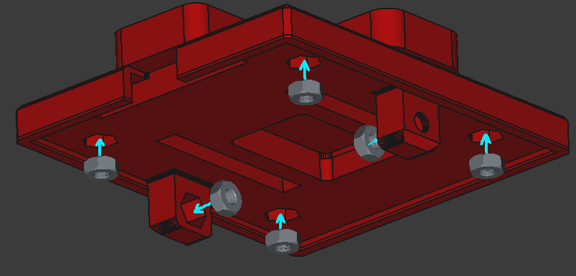
</p>

#### 5.3. Join the `chasis` and the `cover`

Use a `M3x8mm bolt` at each side.

<p align="center">
  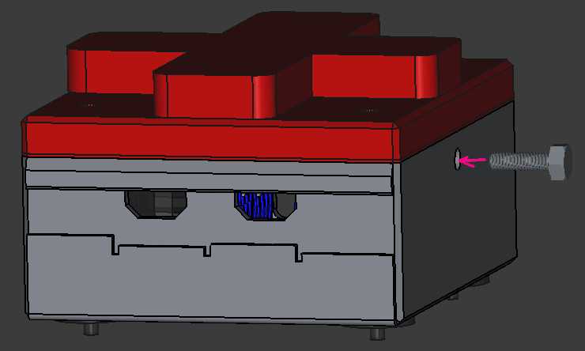
</p>

---
### 6. Joining legs with chasis

How the legs should be placed:

<p align="center">
  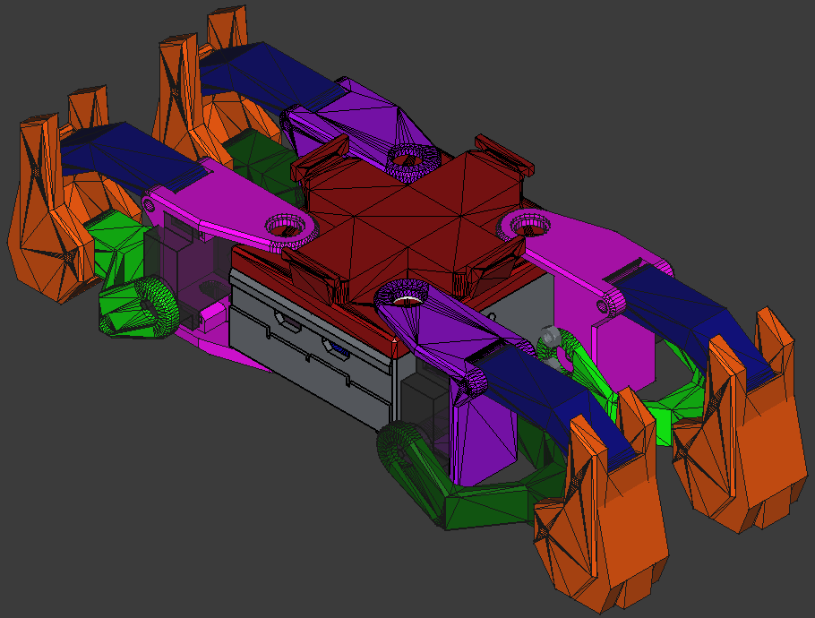
</p>

### 6.1. Leg attachment
Screw the `M3x8mm Bolt` into the nut placed in [step 5.2](#52-chasis-cover-m3-nuts1).

<p align="center">
  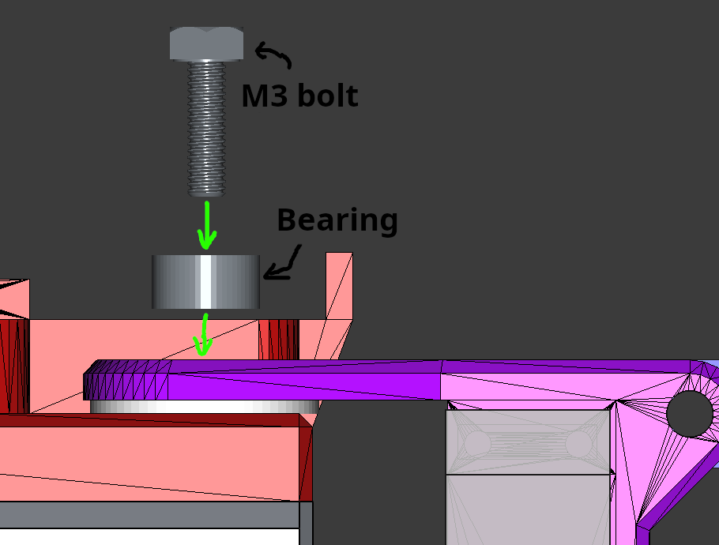
</p>

---
### 7. Assembling upper box

#### 7.1. Place the `HC-SR04` sensors

<p align="center">
  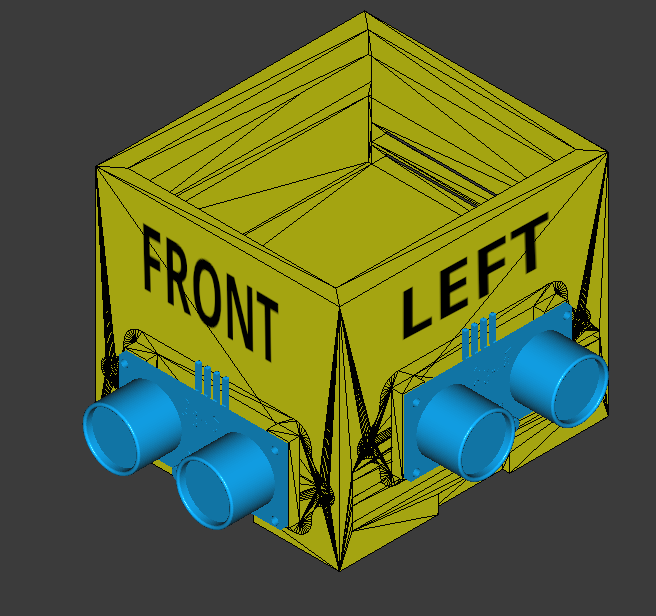
</p>

Now, place the `US sensor chasis` for each sensor:

<p align="center">
  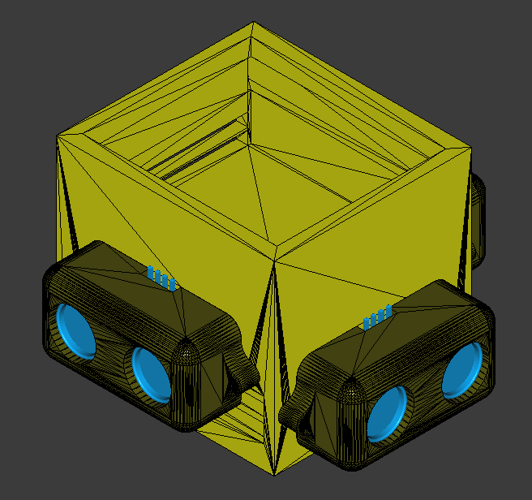
</p>

#### 7.2. Place the `Battery`

Before placing the battery, remove the XH2.54-2P connector from the wires and add the `switch` for turning ON and OFF the robot.

**Connector:**


**Switch connection:**

```
 ---------                          -----------
|         |---[+]------------------|           |
| Battery |                        | Connector |
|         |---[-]------------------|           |
 ---------                          -----------
```

1. Remove the connector
```
 ---------                               -----------
|         |---[+]------------------     |           |
| Battery |                             | Connector |
|         |---[-]------------------     |           |
 ---------                               -----------
```

2. Cut the wire
```
 ---------                               -----------
|         |---[+]------------------     |           |
| Battery |                             | Connector |
|         |---[-]----- ✂️ ---------     |           |
 ---------                               -----------
```

3. Add and solder the switch
```
 ---------                                   -----------
|         |---[+]----------------------     |           |
| Battery |                                 | Connector |
|         |---[-]----🧑‍🏭| Switch |🧑‍🏭----     |           |
 ---------                                   -----------
```

**Placing the `battery`**:

Then, insert the battery into the Up box, routing the wires to the upper compartment through the small slot in the corner. And then connect again the battery connector.

<p align="center">
  
</p>

Attach, using 2 `M1x5mm sheet metal screws`, the `Battery limit` to the box.

<p align="center">
  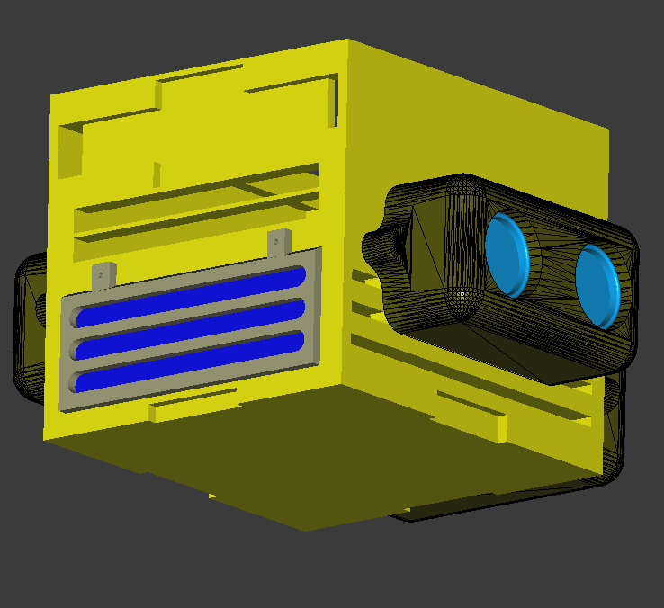
</p>

#### 7.3. Add the `DC-DC Buck module`

First of all, cut 2 pieces of 16 AWG wire (~80 mm each), and solder them to a female XH2.54-2P.

Now, feed the wires through the back-right hole, leading them out the back.

<p align="center">
  
</p>

Now, you will solder this 2 cables to the VIN and GND terminals from the `DC-DC Buck`. To avoid a short circuit, is **ESSENTIAL** that you consider the connection of XH2.54 male (from the battery) and female (from the `DC-DC Buck`):

<p align="center">
  
</p>

<p align="center">
  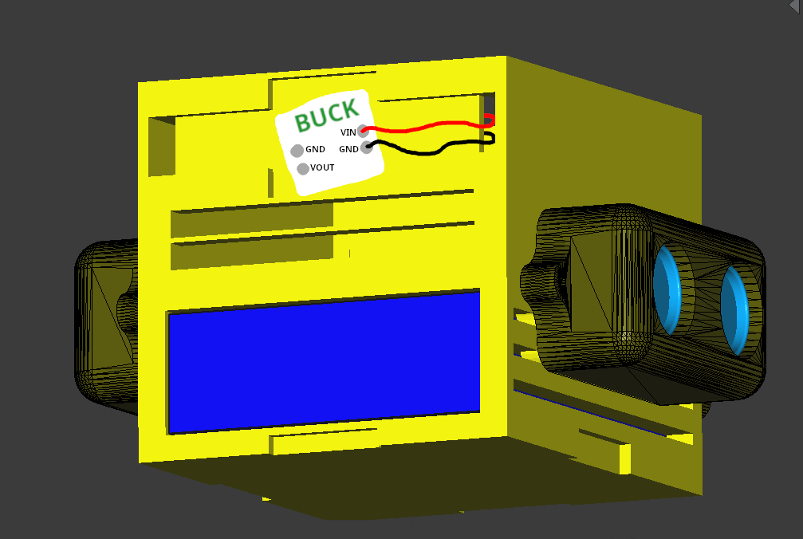
</p>

Solder the output wires (16 AWG ~110 mm each) to the `DC-DC Buck` output pins.

<p align="center">
  
</p>

Place the `DC-DC Buck` in its slot and feed the output wires through the back-right hole, leading them inside the box again. And secure the wires with a zip tie on each side.

<p align="center">
  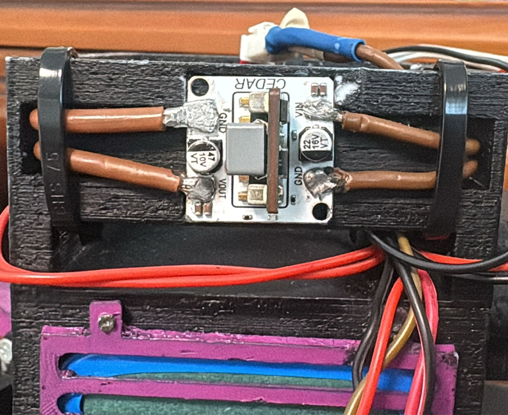
</p>

#### 7.4. Terminal blocks connections

Wires that will be used:
+ Vout and GND wires conected to `DC-DC Buck`
+ `ESP32` Vin or 5V (check end of [part 4](#4-connecting-servos-to-pca9685))
+ `ESP32` GND (check end of [part 4](#4-connecting-servos-to-pca9685))
+ `PCA9685` V+ (check end of [part 4](#4-connecting-servos-to-pca9685))
+ `PCA9685` GND (check end of [part 4](#4-connecting-servos-to-pca9685))
+ 6 `female-to-female jumper wires`, cut and stripped on one end.

First, loosen the two screws on each of the two `terminal blocks`.

Then, wist the exposed strands of the following wires:
+ Group (+):
  - `ESP32` Vin or 5V
  - `PCA9685` V+
  - 3 `female-to-stripped jumper wires`
+ Group (-):
  - `ESP32` GND
  - `PCA9685` GND
  - 3 `female-to-stripped jumper wires`

Now, inside the `up box`, using the `terminal blocks`, make this connections:

<p align="center">
  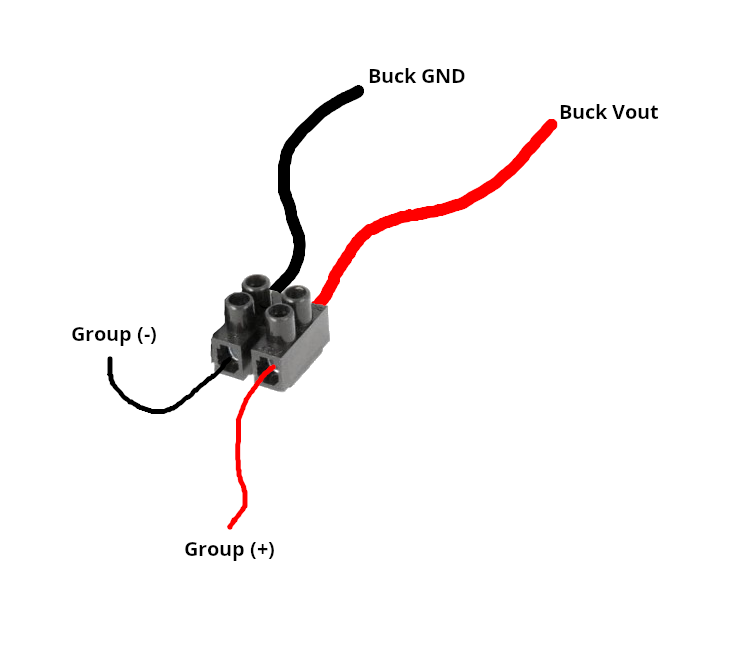
</p>

Letting out of the box the *"Groups' wires"*, as shown in the image:

<p align="center">
  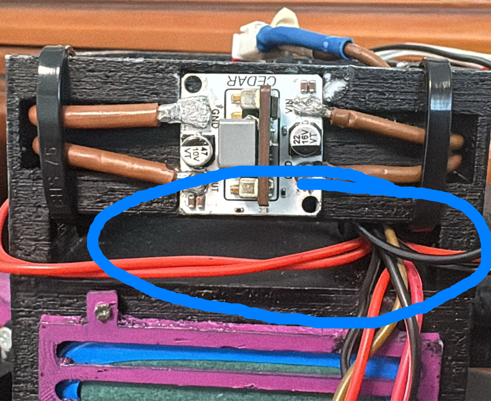
</p>

#### 7.5. Connecting `HC-SR04` sensors to power supply

Connect the `HC-SR04` sensors to the power supply to the `female-to-stripped jumper wires` from the `terminal blocks`:

```
Jumper from Group (+) <---> HC-SR04 Vcc
Jumper from Group (-) <---> HC-SR04 GND
```

Use this image as reference:
<p align="center">
  
</p>


---
### 8. Joining upper box with chasis

#### 8.1. Attach `up box` to `chasis cover`

The tabs on the chassis cover are designed to fit into the slots on the bottom of the Up box. You will probably hear a 'click' when it is fully seated.

<p align="center">
  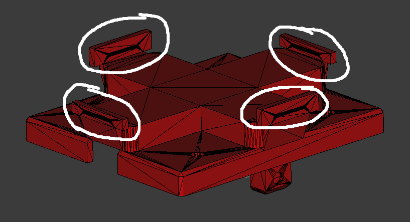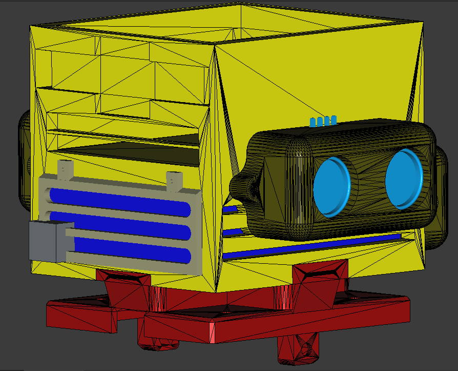
  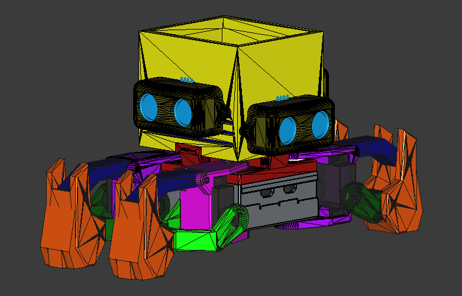
</p>


#### 8.2 Connect the `HC-SR04` sensors with `ESP32`

| `HC-SR04` sensor | Trigger GPIO | Echo GPIO
| :--- | :---: | ---: |
| Frontal | 15 | 2 |
| Right | 17 | 5 |
| Left | 4 | 16 |

---
### 9. Assembling legs (Part 2)

Finally, we will attach the end of each servo to its corresponding joint.

#### 9.1. Set all servos to angle 0

We want the legs to be in approximately the same position when the 'STANDING' pose is commanded. To do this, upload the [`brutus_esp32.ino`](../src/brutus_esp32/brutus_esp32.ino) code to the robot and set it to STAND mode via the terminal or app.

#### 9.2. Attach servo's single-arm horns

With STAND mode active, position each shoulder and elbow approximately as shown in the images.

<p align="center">
  
  
</p>

Once positioned, fit the single-arm horn onto the servo, inserting the long end into the corresponding slot of the 3D-printed part. Then, using two M1x5mm sheet metal screws per servo, secure it by screwing into the nearest and furthest holes.

Now, power off the robot and use the bolt included with the servo to secure the horn to the servo's output shaft.


---

## Mechanical Maintenance

The mechanical structure of Brutus is composed of 3D-printed PLA parts, metal fasteners, bearings, and servo-mounted joints. Because the robot is constantly subjected to vibration, cyclic loads, and impacts during walking, periodic mechanical inspection is mandatory to avoid failures.

---

### Fasteners and Joint Inspection

Brutus uses the following fasteners in its structure:

- M3 bolts  
- M3 nuts  
- Sheet metal screws 
- Servo horn screws  

These elements are exposed to repeated mechanical stress during operation, especially in the legs.

The most critical areas are:
- Shoulder joints  
- Elbow joints  
- Leg link pivots  
- Foot attachments  

These joints are held together using **M3 bolts and M3 nuts inserted into the 3D-printed parts**. During normal walking, these nuts may gradually loosen and, in some cases, may even slide out of their slots if not properly tightened.

If this happens:
- The leg will develop mechanical play (backlash)
- The kinematics will become inaccurate
- The servo will be forced to compensate for the misalignment
- This leads to increased torque demand, overheating, and possible servo failure

For this reason, all leg fasteners must be inspected and tightened regularly.

---

### Bearing Condition

Each leg contains F693ZZ bearings that allow smooth rotation of the joints. These bearings must rotate freely without friction.

Signs of bearing problems:
- Grinding noise
- Increased resistance when moving a leg by hand
- Jerky or uneven motion

If a bearing becomes stiff or blocked, the servo driving that joint will operate near stall torque, which can quickly damage the servo.

---

### Servo Mounting and Horns

The MG90S servos are attached to the structure using sheet metal screws, and their horns are fixed using small M1 self-tapping screws and a central shaft screw.

These screws must be checked for:
- Looseness
- Cracks in the plastic around the holes
- Misalignment of the horn

A loose servo horn causes angular offset and loss of accuracy, which directly affects gait stability.

A malfunctioning servo can cause unstable motion, high power consumption, mechanical stress, and unpredictable behavior of the robot. The following methods allow early detection of servo problems before permanent damage occurs.

---
#### 1. Visual and Motion Inspection

While the robot is powered and standing:

- Check that all joints:
  -  Reach their commanded position
  -  Move smoothly
  -  Stop when they reach the target angle
  -  Do not overshoot or oscillate

- Warning signs:

  - One leg does not move when commanded  
  - A joint moves slower than the others 
  - The servo vibrates without changing position  
  - The servo does not return to its neutral pose
   
- This often indicates:
  - Internal gear damage  
  - Encoder failure 
  - Loss of power  
  - Mechanical binding

---

### Printed Part Inspection

All structural parts are made from PLA and are therefore subject to:
- Fatigue
- Creep
- Cracking due to cyclic load

Special attention should be paid to:
- Shoulder mounts
- Elbow parts
- Leg link interfaces
- Foot pieces

If any crack, deformation, or excessive wear is detected, the affected part must be replaced to avoid catastrophic failure during operation.

---

## Battery Maintenance and Safety

Brutus is powered by a 3S Li-ion battery. Proper handling and maintenance of the battery is critical for both safety and system reliability.

### Voltage limits
- The battery must **never be discharged below 8.0 V**.  
  Below this level, the cells may suffer irreversible damage and the BMS may permanently cut off the pack.

- The battery must **never be charged above 12.6 V**.  
  Overvoltage can cause overheating, swelling, or fire hazards.

The DC-DC buck converter will stop regulating correctly if the battery voltage falls too low, which can cause resets or erratic behavior of the ESP32 and servos.

---
### Storage recommendations
When the robot will not be used for extended periods:
- Store the battery at approximately **50–60% charge**
- Disconnect it from the robot
- Keep it in a cool, dry place

Storing the battery fully charged or fully empty for long periods significantly reduces its lifetime.

Regular battery inspection and correct charging practices are essential to ensure safe and reliable operation of Brutus.


---

### Manual Leg Check

Before powering the robot:
1. Move each leg gently by hand
2. Verify that all joints move smoothly
3. Check that there is no excessive play in the pivots
4. Confirm that no nut is missing or loose

This simple procedure prevents most mechanical failures before they occur.

---

### Electrical Connections and Wiring Integrity

All the main electrical connections of Brutus — including the ESP32, PCA9685, RGB LED and DC-DC buck converter — are permanently soldered.  
Only the ultrasonic sensors (HC-SR04) and the servos are connected using removable jumper cables.

This design minimizes contact resistance, vibration-related failures and voltage drops in high-current paths.

The power distribution of the robot follows this chain:

Battery → Switch → DC-DC Buck → Terminal Blocks → ESP32 + PCA9685 + HCSR-04 → servos + LED RGB

---
#### Critical power cables

Some cables are especially critical for safe and stable operation:

| Cable | Gauge | Function |
|------|------|--------|
| Battery → DC-DC Buck | **16 AWG** | Carries the full battery current. Any fault here will instantly shut down the robot. |
| DC-DC Buck → PCA9685 (V+ and GND) | **20 AWG** | Supplies power to all servos. A bad contact will cause servo resets or brownouts. |
| DC-DC Buck → ESP32 (5V and GND) | **26 AWG** | Powers the control electronics. A bad connection causes ESP32 resets or WiFi loss. |

These cables must always be firmly soldered and mechanically strain-relieved.

---
#### Connections most likely to cause power loss

If the robot suddenly shuts down, reboots, or loses servo power, the most common causes are:

- Loose terminal block screws
- Broken solder joints on:
  - Battery wires
  - DC-DC buck input or output
  - PCA9685 power pins
- Fatigued 16 AWG battery wires near the switch or buck module

These should be inspected first before suspecting software faults.

---
#### Detecting bad contacts

A poor electrical connection typically causes one or more of the following symptoms:
- ESP32 resets when servos move
- Servos twitch or stop responding under load
- WiFi or MQTT disconnects when the robot walks
- LED flickers or changes brightness unexpectedly

To check for false contacts:
1. Power the robot ON.
2. Gently move each power cable and terminal block.
3. If the robot resets, flickers or stops, that wire has a faulty connection.
4. Re-solder or re-tighten the affected connection immediately.

---
#### Ultrasonic sensor cables

The HC-SR04 sensors are connected via removable jumper cables. These may become loose over time and should be checked periodically, especially if distance readings become unstable or incorrect.

---
## User Manual

This User Manual explains how to operate, control, and understand the internal software structure of the Brutus quadruped robot.
It is intended for users who want to run the robot, send commands, monitor its state, and modify its behavior through the ESP32 firmware and MQTT communication system.

This user manual focuses on:

- How Brutus is started and configured
- How it receives commands
- How it changes behavior between modes
- How its motion and perception systems are coordinated 
- How to control it remotely via MQTT

It also provides an overview of the main firmware components so that future users can safely extend or debug the robot without breaking its core behavior.

--- 
### Network and MQTT configuration

The file credential.h contains all the network credentials and communication parameters required for the ESP32 to connect to a WiFi network and to the MQTT broker.
This file is intentionally separated from the rest of the code in order to keep sensitive information (usernames, passwords, and network names) isolated and easy to modify without changing the main program.

This approach also allows each user to configure their own credentials without affecting the shared project code.
---
#### WiFi configuration

The system supports two different WiFi connection modes:
- **Eduroam network**, which requires a username and password instead of only an SSID and a WiFi key
- **Home / Office WiFi network**, in which only an SSID and a password are required
---
#### Network selection

In the main firmware, a configuration parameter determines whether the ESP32 should connect to the Eduroam network or to a standard WiFi network.

Depending on this parameter, the corresponding set of credentials (SSID_EDUROAM + USERNAME_EDUROAM + PASSWORD_EDUROAM, or SSID + PASSWORD) is used to establish the connection.

This design allows the same firmware to be used in different environments (university, home, office, etc.) without modifying the core program logic.

---
#### MQTT configuration

The file also defines the parameters used to connect to the MQTT broker, the values selected in the files specify the address and port of the MQTT server used for communication between the robot and external systems.

---
#### Security considerations

Since this file contains private credentials, it should not be shared publicly or uploaded to version control repositories with real data.
Each user should keep their own local copy of credential.h with their personal WiFi and Eduroam credentials.

---
#### `Credential.h` template
```cpp
#ifndef CREDENTIAL_H
#define CREDENTIAL_H

// =====================
//  WIFI - Eduroam
// =====================
#define SSID_EDUROAM     "eduroam"   // Your eduroam SSID
#define USERNAME_EDUROAM ""          // Your eduroam username
#define PASSWORD_EDUROAM ""          // Your eduroam password

// =====================
//  WIFI - Home / Office
// =====================
#define SSID     ""  // Your WiFi SSID
#define PASSWORD ""    // Your WiFi password

// =====================
//  MQTT
// =====================
#define MQTT_SERVER "test.mosquitto.org"  // Your MQTT broker address
#define MQTT_PORT   1883                 // Your MQTT broker port

#endif // CREDENTIAL_H
```
---

## `brutus_params.h` – Robot configuration and motion parameters

The file brutus_params.h contains all the global configuration parameters that define the electrical, mechanical and motion behavior of the Brutus robot.
It centralizes all tunable values so that the robot can be calibrated, adapted and modified without changing the core control logic.

This file covers:

- Servo configuration

- GPIO pin mapping

- Leg geometry and calibration

- FreeRTOS task configuration

- Motion poses and gait definitions

- Speed limits

- Perception system timing

---
### Servo configuration

```cpp
#define PWM_SERVO_FREQ 50
#define MIN_SERVO_ANGLE -90.0
#define MAX_SERVO_ANGLE 90.0
#define MIN_SERVO_PWM_PULSE_US 500
#define MAX_SERVO_PWM_PULSE_US 2500
```

These parameters define how the PWM signals are generated for the servos:

- `PWM_SERVO_FREQ` defines the PWM frequency (50 Hz), which is standard for RC servos.

- `MIN_SERVO_ANGLE` and `MAX_SERVO_ANGLE` define the angular range used by the software.

- `MIN_SERVO_PWM_PULSE_US` and `MAX_SERVO_PWM_PULSE_US` define the electrical PWM pulse width corresponding to the minimum and maximum angles.

---
### GPIO configuration

The GPIO section defines how the ESP32 is electrically connected to the sensors and actuators:
```cpp
#define US_R_TRIG 17
#define US_R_ECHO 5

#define US_L_TRIG 4
#define US_L_ECHO 16

#define US_F_TRIG 15
#define US_F_ECHO 2

#define R_PIN 32
#define G_PIN 25
#define B_PIN 33

#define PCA9685_OE 19
```

These pins correspond to:

- Three ultrasonic distance sensors (front, left and right).

- An RGB LED (R, G, B channels).

- The Output Enable (OE) pin of the PCA9685 servo controller.

---
### Leg servo mapping

Each leg has two servos:

- A shoulder (horizontal movement)

- An elbow (vertical movement)

The file defines which PCA9685 channel controls each servo:

```cpp
#define SHOULDER_BACK_LEFT_PCA_PIN 0
#define ELBOW_BACK_LEFT_PCA_PIN    1

#define SHOULDER_BACK_RIGHT_PCA_PIN 2
#define ELBOW_BACK_RIGHT_PCA_PIN    3

#define SHOULDER_FRONT_LEFT_PCA_PIN 9
#define ELBOW_FRONT_LEFT_PCA_PIN    8

#define SHOULDER_FRONT_RIGHT_PCA_PIN 13
#define ELBOW_FRONT_RIGHT_PCA_PIN    12
```

---
### Servo calibration

Mechanical assembly imperfections mean that servos are never perfectly aligned.
To compensate for this, angular offsets are defined for each joint:

```cpp
#define SHOULDER_BACK_LEFT_ANGLE_OFFSET -2.0
#define ELBOW_BACK_LEFT_ANGLE_OFFSET    -5.0

#define SHOULDER_BACK_RIGHT_ANGLE_OFFSET 3.0
#define ELBOW_BACK_RIGHT_ANGLE_OFFSET    0.0

#define SHOULDER_FRONT_LEFT_ANGLE_OFFSET -10.0
#define ELBOW_FRONT_LEFT_ANGLE_OFFSET    -12.0

#define SHOULDER_FRONT_RIGHT_ANGLE_OFFSET -2.0
#define ELBOW_FRONT_RIGHT_ANGLE_OFFSET    -20.0
```

In addition, because of the colocation of some legs, some servos are mounted in inverted orientations. This is handled by:

```cpp
#define SHOULDER_BACK_LEFT_INVERTED false
#define ELBOW_BACK_LEFT_INVERTED    true

#define SHOULDER_BACK_RIGHT_INVERTED true
#define ELBOW_BACK_RIGHT_INVERTED    false

#define SHOULDER_FRONT_LEFT_INVERTED false
#define ELBOW_FRONT_LEFT_INVERTED    false

#define SHOULDER_FRONT_RIGHT_INVERTED true
#define ELBOW_FRONT_RIGHT_INVERTED    true
```

---
### FreeRTOS task configuration

The robot software runs on FreeRTOS using two CPU cores:
```cpp
#define MOTION_CORE  0
#define LOGIC_CORE   1
```

- The motion core handles gait generation and servo control.

- The logic core handles perception, communication and high-level decision making.

Task timing is controlled by:

```cpp
#define DEFAULT_MOTION_PERIOD 300
#define MODES_PERIOD 200
```

These values define how often motion and logic tasks are executed.

---
### Pose and gait definition

The robot motion is defined using poses, represented by the `BrutusPose` structure:

```cpp
struct BrutusPose {
  BrutusLegState fr_leg_state;
  BrutusLegState fl_leg_state;
  BrutusLegState br_leg_state;
  BrutusLegState bl_leg_state;
};
```
Each pose contains the desired joint angles for the four legs.

Each pose contains the desired joint angles for the four legs.

A **gait** is defined as a sequence of poses:

```cpp
constexpr BrutusPose GAIT_STEPS[6] {GAIT_1, GAIT_2, ... , GAIT_6};
```
These poses describe a walking cycle.
A backward gait is also defined by reversing this sequence.

Spin-in-place motions are defined using the `SPIN_STEPS` arrays.

This approach makes it easy to design and tune locomotion by editing poses rather than writing complex motion equations.

---
### Speed limits

```cpp
#define MIN_W -1.0f
#define MAX_W 1.0f

#define MIN_V -1.0f
#define MAX_V 1.0f
```
These values define the allowed ranges for:

- Linear velocity (V)

- Angular velocity (W)

They are used by higher-level control to limit how fast the robot can move or turn.

---
### Perception system
```cpp
#define N_DISTANCE_SENSORS 3
#define PERCEPTION_PRIO 3
#define PERCEPTION_PERIOD 200
#define MIN_PERCEPTION_TIMEOUT 10
```

These parameters configure the ultrasonic sensor system:

- Number of sensors.

- FreeRTOS task priority.

- Update period (every 200 ms).

- Minimum allowed timeout for a measurement.

This ensures reliable obstacle detection without blocking the rest of the system.

---
## `comms_params.h` – MQTT communication configuration

The file comms_params.h centralizes all the configuration required for the robot’s communication layer.
It defines the MQTT client identity, the subscribed and published topics, timing parameters for connection handling, message buffers, and default command/data structures used at startup.

This file is designed to keep the MQTT interface consistent and easy to maintain. 

---
### MQTT client identifier

```cpp
#define CLIENT_ID "brutus_esp"
```

This is the unique MQTT client identifier used when the ESP32 connects to the broker.

---
### Subscribed topics (commands to the robot)

```cpp
#define TOPIC_CMD_MODE   "brutus/cmd/mode"
#define TOPIC_CMD_VEL    "brutus/cmd/velocity"
#define TOPIC_CMD_POSE   "brutus/cmd/pose"
```

The robot subscribes to these topics to receive commands from an external controller:

- brutus/cmd/mode: change the robot operating mode.

- brutus/cmd/velocity: set linear and angular velocity references.

- brutus/cmd/pose: directly command a full pose to the robot.

To simplify internal handling, each command is also mapped to an integer code:

```cpp
#define CMD_MODE   0
#define CMD_VEL    1
#define CMD_POSE   2
```
---
### Published topics (robot telemetry)

```cpp
#define TOPIC_STATE_HEARTBEAT "brutus/data/heartbeat"
#define TOPIC_POSE            "brutus/data/pose"
#define TOPIC_DIST_FRONT      "brutus/data/distance/front"
#define TOPIC_DIST_RIGHT      "brutus/data/distance/right"
#define TOPIC_DIST_LEFT       "brutus/data/distance/left"
```

The robot publishes telemetry data to these topics:

- `brutus/data/heartbeat`: periodic status message that indicates the robot is alive and connected.

- `brutus/data/pose`: the pose currently executed by the robot.

- `brutus/data/distance/*`: distances measured by the ultrasonic sensors (front, right, left).

Similarly, message types are mapped to integer identifiers:

```cpp
#define STATE_HEARTBEAT 0
#define POSE            1
#define DIST_FRONT      2
#define DIST_RIGHT      3
#define DIST_LEFT       4
```
---
### Connection timing parameters

```cpp
#define WIFI_WAIT 500
#define RECONNECT_WAIT 3000
```

- `WIFI_WAIT` sets the delay (in milliseconds) used while waiting for WiFi to connect.

- `RECONNECT_WAIT` sets the delay (in milliseconds) between MQTT reconnection attempts if the connection is lost.

These values avoid aggressive reconnection loops and help keep the system stable.

---
### Network mode selection (Eduroam vs normal WiFi)

```cpp
#define IS_EDUROAM false
```

This parameter selects which WiFi credentials should be used during initialization:

- true: connect using ***Eduroam*** credentials (enterprise authentication).

- false: connect using a ***standard WiFi network*** (SSID + password).

The actual credentials are defined in credential.h, while this flag determines which set of credentials will be used by the connection code.

---
### Ranges for test/debug messages

```cpp
#define MIN_LEG_DEG 0
#define MAX_LEG_DEG 181
#define MIN_DIST 0
#define MAX_DIST 200
```

These ranges are created in order to put a limit to the leg degrees and the distance the ultrasonic sensor can reach.

---
### Joint identifier strings

```cpp
#define SHOULDER "0"
#define ELBOW "1"
```

These string identifiers are used in message payloads (JSON fields) to label which joint is being referenced.

---
### Buffers and message sizes

```cpp
#define MSG_BUFFER 254
#define JSON_BUFFER 300
```

These values define the maximum sizes used to store incoming/outgoing MQTT payloads:

- `MSG_BUFFER`: raw MQTT message buffer length.

- `JSON_BUFFER`: buffer size for JSON serialization/deserialization.

---
### Task timing and serial configuration

```cpp
#define COMMS_PERIOD 200
#define COMMS_CORE LOGIC_CORE
#define BAUD 115200
```

- `COMMS_PERIOD` defines how often the communications task runs (every 200 ms).

- `COMMS_CORE` pins the task to the logic core (LOGIC_CORE), keeping communications separate from real-time motion control.

- `BAUD` sets the serial debugging baud rate.

---
### Default startup command and telemetry

```cpp
constexpr BrutusCommsCmd START_CMD {0, 0.0, 0.0, STANDING_POSE};
constexpr BrutusCommsData START_DATA {STANDING_POSE, 0.0, 0.0, 0.0};
```

At startup, the robot initializes both the current command and telemetry structures with safe default values:

- START_CMD initializes:

  - mode = 0 (default mode)

  - linear velocity v = 0.0

  - angular velocity w = 0.0

  - pose = STANDING_POSE

- START_DATA initializes:

  - pose = STANDING_POSE

  - ultrasonic distances set to 0.0 until valid measurements are available.

---

## User Sketch
### Enum Declaration

This enum is declared to be used in the state machine created in the logic task.
```c
enum FuncMode {
  STANDING = 0,
  EXERCISE_1 = 1,
  EXERCISE_2 = 2,
  LEG_CONTROL = 3,
  VEL_CONTROL = 4
};
```
---
### Variable Declaration

In this section, the main system objects are declared.  
The **PCA (`Adafruit_PWMServoDriver`)** is not only declared but also **initialized to enable control of the different servos**.  
Additionally, the `brutus_comms` object is declared, which is responsible for communications, and the `brutus` object, which handles both motion control and sensory processing.  
Finally, the *task handle* that manages the system logic is declared.


```c
Adafruit_PWMServoDriver pca = Adafruit_PWMServoDriver();

Brutus brutus;
BrutusComms brutus_comms;

TaskHandle_t mode_task_handle;
```
---
### Setup()
#### Brutus
First, Brutus is prepared for operation by calling the general setup function. In this step, the PCA controller, the LED pins, and the PWM frequency used for servo control are assigned.

Next, the setup functions for each of Brutus’ legs are called individually. In each call, the PCA pins to which the two servos of each leg (shoulder and elbow) are connected are specified, along with the minimum and maximum PWM values and the angular limits for each servomotor. Angular offsets are also defined to compensate for possible mechanical inaccuracies caused by imperfect physical calibration. Due to the physical arrangement of the legs, some servos require inversion of the rotation direction to ensure correct movement; this behavior is configured using the last two parameters of each function.

Then, the perception system is initialized, which includes the ultrasonic sensors. Once all configuration steps are completed, the function brutus.start() is called, leaving the system fully ready for use.

After this initialization, it is possible to set the robot’s desired initial configuration. The code provides an example of a possible initial setup.

Finally, the task that will manage both movement and perception is created

```c
brutus.setup(&pca,
               PCA9685_OE,
               R_PIN,
               B_PIN,
               G_PIN,
               PWM_SERVO_FREQ);

brutus.setup_front_right_leg(SHOULDER_FRONT_RIGHT_PCA_PIN, ELBOW_FRONT_RIGHT_PCA_PIN,
                            MIN_SERVO_PWM_PULSE_US, MAX_SERVO_PWM_PULSE_US,
                            MIN_SERVO_PWM_PULSE_US, MAX_SERVO_PWM_PULSE_US,
                            MIN_SERVO_ANGLE, MAX_SERVO_ANGLE,
                            MIN_SERVO_ANGLE, MAX_SERVO_ANGLE,
                            SHOULDER_FRONT_RIGHT_ANGLE_OFFSET, ELBOW_FRONT_RIGHT_ANGLE_OFFSET,
                            SHOULDER_FRONT_RIGHT_INVERTED, ELBOW_FRONT_RIGHT_INVERTED);

brutus.setup_front_left_leg(SHOULDER_FRONT_LEFT_PCA_PIN,    ELBOW_FRONT_LEFT_PCA_PIN,
                            MIN_SERVO_PWM_PULSE_US, MAX_SERVO_PWM_PULSE_US,
                            MIN_SERVO_PWM_PULSE_US, MAX_SERVO_PWM_PULSE_US,
                            MIN_SERVO_ANGLE, MAX_SERVO_ANGLE,
                            MIN_SERVO_ANGLE, MAX_SERVO_ANGLE,
                            SHOULDER_FRONT_LEFT_ANGLE_OFFSET, ELBOW_FRONT_LEFT_ANGLE_OFFSET,
                            SHOULDER_FRONT_LEFT_INVERTED, ELBOW_FRONT_LEFT_INVERTED);

brutus.setup_back_right_leg(SHOULDER_BACK_RIGHT_PCA_PIN, ELBOW_BACK_RIGHT_PCA_PIN,
                            MIN_SERVO_PWM_PULSE_US, MAX_SERVO_PWM_PULSE_US,
                            MIN_SERVO_PWM_PULSE_US, MAX_SERVO_PWM_PULSE_US,
                            MIN_SERVO_ANGLE, MAX_SERVO_ANGLE,
                            MIN_SERVO_ANGLE, MAX_SERVO_ANGLE,
                            SHOULDER_BACK_RIGHT_ANGLE_OFFSET, ELBOW_BACK_RIGHT_ANGLE_OFFSET,
                            SHOULDER_BACK_RIGHT_INVERTED, ELBOW_BACK_RIGHT_INVERTED);

brutus.setup_back_left_leg(SHOULDER_BACK_LEFT_PCA_PIN, ELBOW_BACK_LEFT_PCA_PIN,
                            MIN_SERVO_PWM_PULSE_US, MAX_SERVO_PWM_PULSE_US,
                            MIN_SERVO_PWM_PULSE_US, MAX_SERVO_PWM_PULSE_US,
                            MIN_SERVO_ANGLE, MAX_SERVO_ANGLE,
                            MIN_SERVO_ANGLE, MAX_SERVO_ANGLE,
                            SHOULDER_BACK_LEFT_ANGLE_OFFSET, ELBOW_BACK_LEFT_ANGLE_OFFSET,
                            SHOULDER_BACK_LEFT_INVERTED, ELBOW_BACK_LEFT_INVERTED);

brutus.setup_perception(US_R_TRIG,
                        US_R_ECHO,
                        US_L_TRIG,
                        US_L_ECHO,
                        US_F_TRIG,
                        US_F_ECHO,
                        MIN_PERCEPTION_TIMEOUT);

brutus.start();

brutus.set_linear_speed_ts(0.0);
brutus.set_angular_speed_ts(0.0);
brutus.change_target_pose(STANDING_POSE);

brutus.set_motion_control_mode(POSE_CONTROL);

brutus.create_motion_task(DEFAULT_MOTION_PERIOD, MOTION_CORE);
brutus.create_perception_task(PERCEPTION_PERIOD, LOGIC_CORE, PERCEPTION_PRIO);
```
---
#### Brutus Comms
To initialize BrutusComms, simply call the start function first, and then create the task that will manage communications.

```c
brutus_comms.start(&brutus);
brutus_comms.create_comms_task(COMMS_CORE); 

```

---
#### Logic Task
Finally, we create the task that will manage Brutus’ highest-level logic, that is, what to do in each mode.
```c
  xTaskCreatePinnedToCore(
    (TaskFunction_t)mode_task,
    "ModeTask",
    MODES_TASK_SIZE,
    NULL,
    2,
    &mode_task_handle,
    LOGIC_CORE
  );
```

---

## Logic Task Definition
It is worth noting that in each mode we change the eye color to indicate the current mode, although this is not strictly necessary.

```c
void
mode_task(void* pvParameters)
{
  BrutusCommsCmd cmd;
  
  // Initial values
  enum FuncMode mode = EXERCISE_1;
  enum FuncMode last_mode = STANDING;

  BrutusPose pose = brutus.check_pose(true);

  float fr_elbow = 0.0;
  float fl_elbow = 0.0;
  float br_elbow = 0.0;
  float bl_elbow = 0.0;

  while (true) {
    // We update the command using the information received through MQTT
    cmd = brutus_comms.getCmd();
    mode = FuncMode(cmd.mode);

    switch (mode)
    {
      case STANDING:
        if (mode != last_mode) {
          brutus.eyes_blue();
          // We set Brutus to operate in pose control mode.
          brutus.set_motion_control_mode(POSE_CONTROL);
          last_mode = mode;
        }
        // Set brutus to STANDING_POSE
        brutus.change_target_pose(STANDING_POSE);
        break;
      
      case LEG_CONTROL:
        if (mode != last_mode) {
          brutus.eyes_yellow();
          // We set Brutus to operate in pose control mode.
          brutus.set_motion_control_mode(POSE_CONTROL);
          last_mode = mode;
        }

        brutus.change_target_pose(interp_pose_norm(cmd.pose));
        break;

      case VEL_CONTROL:
        if (mode != last_mode) {
          brutus.eyes_green();
          // We set Brutus to operate in speed control mode.
          brutus.set_motion_control_mode(SPEED_CONTROL);
          last_mode = mode;
        }

        // We use the v and w recived from comms to set Brutus v and w
        brutus.set_linear_speed_ts(cmd.v);
        brutus.set_angular_speed_ts(cmd.w);
        break;

      case EXERCISE_1:
        // Logic of exercise 1
        continue;
        break;

      case EXERCISE_2:
        // Logic of exercise 2
        continue;
        break;

      default:
        break;
    }
  }
}
```
---

## Doxygen

If you want to look for more information about the classes, structs and methods from our project, please checkout [this link](https://sons-of-brutus.github.io/Robot_Brutus/).


