***TODO**: poner bien QUÉ tornillos, tuercas y arandelas son en cada paso.*

# Guide

This assembly instructions are divided in N parts:
1. [Soldering `ESP32` Connections](#1-soldering-esp32-connections)
2. [Assembling chasis (Part 1)](#2-assembling-chasis-part-1)
3. [Assembling legs (Part 1)](#3-assembling-legs-part-1)
4. [Connecting servos to `PCA9685`](#4-connecting-servos-to-pca9685)
5. [Assembling chasis (Part 2)](#5-assembling-chasis-part-2)
6. [Joining legs with chasis](#6-joining-legs-with-chasis)
7. [Assembling upper box](#7-assembling-upper-box)
8. [Joining upper box with chasis](#8-joining-upper-box-with-chasis)
9. [Assembling legs (Part 2)](#9-assembling-legs-part-2)

# Assembly

## 1. Soldering `ESP32` and `PCA9685` Connections

First of all, if your `ESP32` and/or `PCA9685` have soldered pins, first, you should desolder them, so the pin's holes for the upcoming cables are free.

Following the [electronics schematics image](../electronics/brutus_schematic/brutus_electronic_schematics.svg) (<-- Click here to see it bigger):
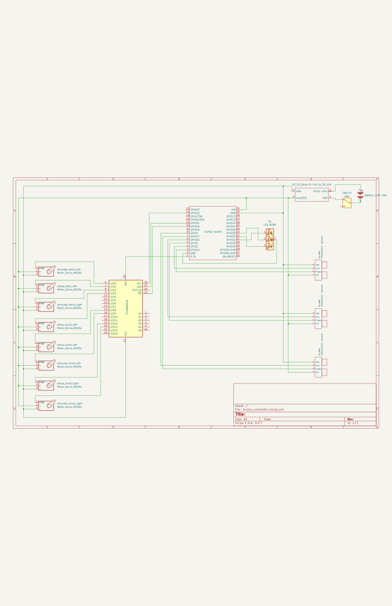

**Important**: Below the table there are important considerations you must take in account while soldering.

Solder the following connections:
| PIN 1 | PIN 2 | Wire | Details |
| :--- | :---: | :---: | ---: |
| `ESP32` Vin or 5V | *Nowhere* | 26 AWG | Leave a relatively large quantity of wire as it will be connected to the `2-Pole Terminal Block` at the upper box. Continued at "[Joining upper box with chasis](#joining-upper-box-with-chasis)" steps. |
| `ESP32` GND | *Nowhere* | 26 AWG | Leave a relatively large quantity of wire as it will be connected to the `2-Pole Terminal Block` at the upper box. Continued at "[Joining upper box with chasis](#joining-upper-box-with-chasis)" steps. |
| `PCA9685` V+ | *Nowhere* | 20 AWG | Leave a relatively large quantity of wire as it will be connected to the `2-Pole Terminal Block` at the upper box. Continued at "[Joining upper box with chasis](#joining-upper-box-with-chasis)" steps. |
| `PCA9685` GND | *Nowhere* | 20 AWG | Leave a relatively large quantity of wire as it will be connected to the `2-Pole Terminal Block` at the upper box. Continued at "[Joining upper box with chasis](#joining-upper-box-with-chasis)" steps. |
| `PCA9685` VCC | `ESP32` 3.3V | 28 AWG | - |
| `PCA9685` SCL | `ESP32` GPIO 22 | 28 AWG | It is **ESSENTIAL** that this connection doesn't change, `PCA9685`'s SCL needs to be connected to `ESP32`'s GPIO 22 |
| `PCA9685` SDA | `ESP32` GPIO 21 | 28 AWG | It is **ESSENTIAL** that this connection doesn't change, `PCA9685`'s SCL needs to be connected to `ESP32`'s GPIO 22 |
| `PCA9685` OE | `ESP32` GPIO 19 | 28 AWG | - |
| `RGB LED` R | `ESP32` GPIO 32 | 28 AWG | - |
| `RGB LED` G | `ESP32` GPIO 25 | 28 AWG | - |
| `RGB LED` B | `ESP32` GPIO 33 | 28 AWG | - |
| `RGB LED` GND | `ESP32` GND | 28 AWG | **VERY IMPORTANT!** This `ESP32` GND pin must not be the same as the one in the 2nd row of this table. |
| `ESP32` GPIO 2 | *Nowhere* | Female-to-female jumper | This wire needs a relatively large quantity of wire as it will be connected to one of the `HC-SR04` at the upper box. Connections at "[Joining upper box with chasis](#joining-upper-box-with-chasis)" steps. |
| `ESP32` GPIO 15 | *Nowhere* | Female-to-female jumper | The same as `ESP32` GPIO 2 |
| `ESP32` GPIO 16 | *Nowhere* | Female-to-female jumper | The same as `ESP32` GPIO 2 |
| `ESP32` GPIO 4 | *Nowhere* | Female-to-female jumper | The same as `ESP32` GPIO 2 |
| `ESP32` GPIO 17 | *Nowhere* | Female-to-female jumper | The same as `ESP32` GPIO 2 |
| `ESP32` GPIO 5 | *Nowhere* | Female-to-female jumper | The same as `ESP32` GPIO 2 |

**Considerations:**
- The wires for the 4 connections between `ESP32` and `PCA9685` should be *long enough* to allow the `chasis cover` to be separated slightly from the `chasis` when it is open, but *short enough* to avoid taking up excess space when closed.
- The 4 wires that connect `RGB LED` and `ESP32` should be long enough to place this two components as explained in "[Assembling chasis (Part 2)](#assembling-chasis-part-2)" steps.
- For each of the 6 wires for `HC-SR04`, you must remove one of the tips of a `Female-to-female jumper`. The removed part is the one soldered to the `ESP32` and the *female* part will be connected to the `HC-SR04`.

## 2. Assembling chasis (Part 1)

#### 2.1. `PCA9685` attachment in the chasis
Put the `PCA9685` in the space at the bottom center of the `chasis` as it is placed in the image:

<p align="center">
  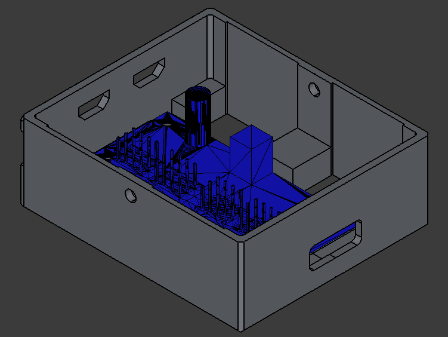
</p>

#### 2.2. Trim the servo wires to fit
All 8 servos will have shorter wires, but in this step we will only consider the 4 servos inside the chasis.

1. Estimate the length of the servo wire. (At least enough to fit in the chasis)
```
 -------            Wire (PWM, GND, VCC)             -----------
|       |-------------------------------------------|           |
| Servo |-------------------------------------------| Connector |
|       |-------------------------------------------|           |
 -------                                             -----------
              |_____________________________|
                        📏 (Excess)

```
2. Cut out the excess section of wire estimated in the previous step.
```
 -------                    Excess Wire                    -----------
|       |------✂️ ---------------------------- ✂️---------|           |
| Servo |------✂️ ---------------------------- ✂️---------| Connector |
|       |------✂️ ---------------------------- ✂️---------|           |
 -------                                                   -----------
```
3. Now solder the servo-side wires to the connector-side wires.
```
 -------                  -----------
|       |-------🧑‍🏭-------|           |
| Servo |-------🧑‍🏭-------| Connector |
|       |-------🧑‍🏭-------|           |
 -------                  -----------
```

#### 2.3. Place the servos in the chasis

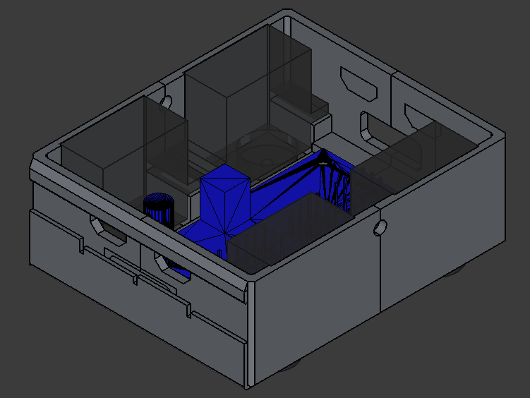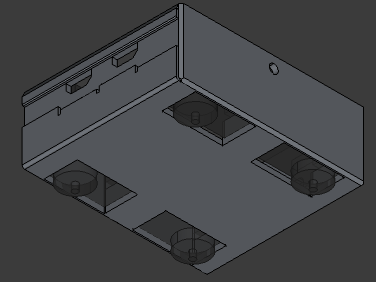

You can use the `sheet metal screws` that are included with the servos to attatch the servos to the chasis.

## 3. Assembling legs (Part 1)

The images are using `Left shoulder` and `Left elbow` pieces, but the same process is applied to `Right shoulder` and `Right elbow`.

#### 3.1. Attatch the servo to the shoulder

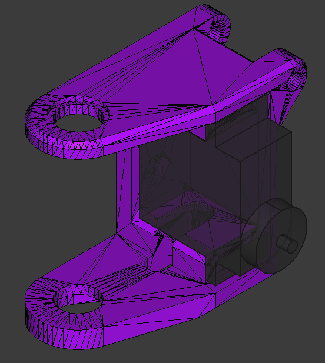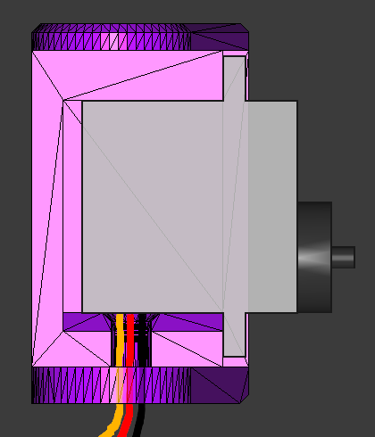

You can use the `sheet metal screws` that are included with the servos to attatch the servo to the shoulder.

**Important:** You should do the [same process off triming the servo's wires](#22-trim-the-servo-wires-to-fit) so they could enter to the chasis and be connected to the `PCA9685`, letting some length for shoulder movement.

<p align="center">
  
</p>

#### 3.2. Join the elbow and the shoulder

First, identify how you shuold place de elbow.

<p align="center">
  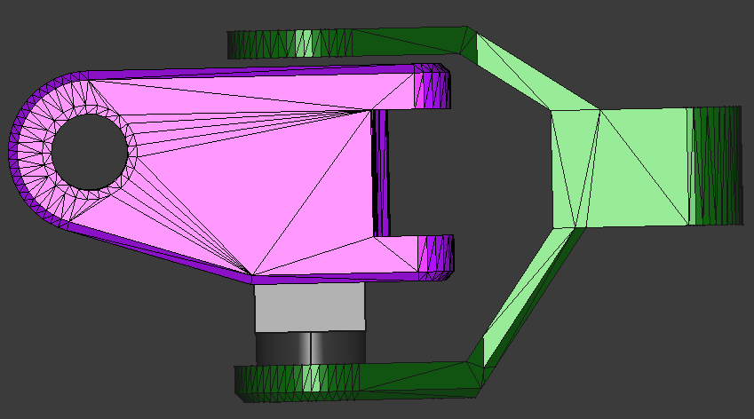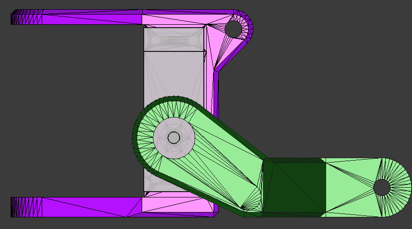
  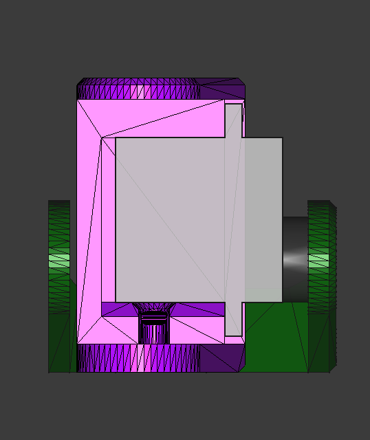
</p>

Then, insert a `M3 nut` into the corresponding slot on the shoulder.

<p align="center">
  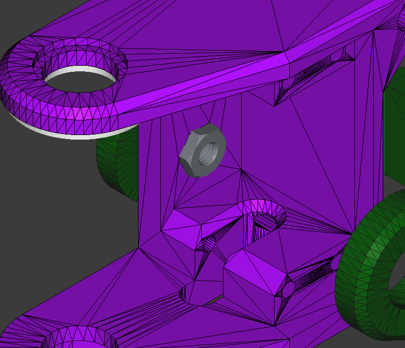
</p>

Finally, screw the elbow to the shoulder as shown, from the non-servo side.


The servo-side will be attached in [part 9](#9-assembling-legs-part-2s).

#### 3.3. Join the `leg up link` and the shoulder

Use `M3x30mm bolt` and `M3 nut`.

<p align="center">
  
</p>

### 3.4. Add the foot

Use `M3x30mm bolts` and a `M3 nuts`.

<p align="center">
  
</p>

### 3.5. Right vs Left
**REMEMBER:** *Left shoulder/elbow* are for *front left* leg and *back right* leg, while *right shoulder/elbow* are for *front right* leg and *back left* leg.

<p align="center">
  
</p>

<p align="center">
  
</p>

## 4. Connecting servos to `PCA9685`

Now you should connect the 8 `servos` to the `PCA9685` following the  [schematic](../electronics/brutus_schematic/brutus_electronic_schematics.svg) (<-- Click here to see it bigger):


```
      0 ---------------------------> 15
```

| Joint | `PCA9685`'s pin |
| :--- | ---: |
| Front Right Shoulder | 13 |
| Front Right Elbow | 12 |
| Front Left Shoulder | 9 |
| Front Left Elbow | 8 |
| Back Right Shoulder | 2 |
| Back Right Elbow | 3 |
| Back Left Shoulder | 0 |
| Back Left Elbow | 1 |

## 5. Assembling chasis (Part 2)

#### 5.1. Attach the `ESP32` and the `RGB LED` to the `chasis cover`

<p align="center">
  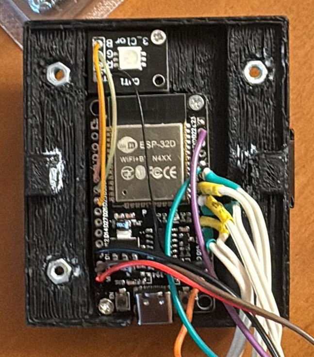
</p>

#### 5.2. `Chasis cover` M3 nuts

You should place 6 M3 nuts in their corresponding slots:

<p align="center">
  
</p>

#### 5.3. Join the `chasis` and the `cover`

Use a `M3x8mm bolt` at each side.

<p align="center">
  
</p>


## 6. Joining legs with chasis

How the legs should be placed:

<p align="center">
  
</p>

### 6.1. Leg attachment
Screw the `M3x8mm Bolt` into the nut placed in [step 5.2](#52-chasis-cover-m3-nuts1).

<p align="center">
  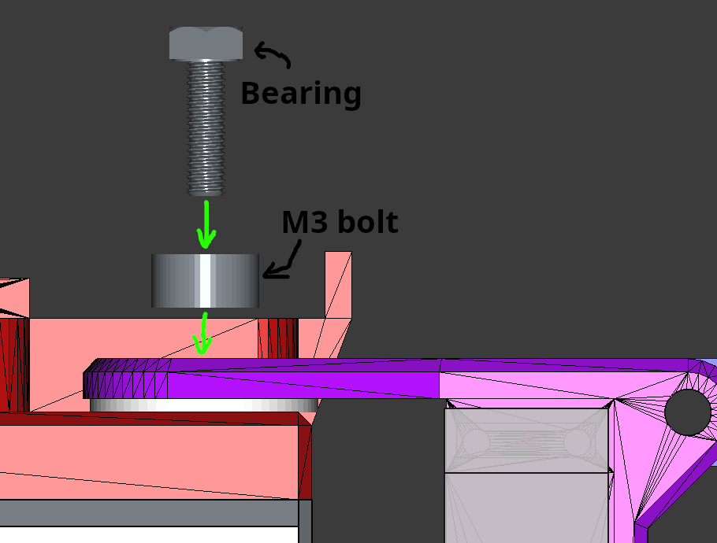
</p>

## 7. Assembling upper box

#### 7.1. Place the `HC-SR04` sensors

<p align="center">
  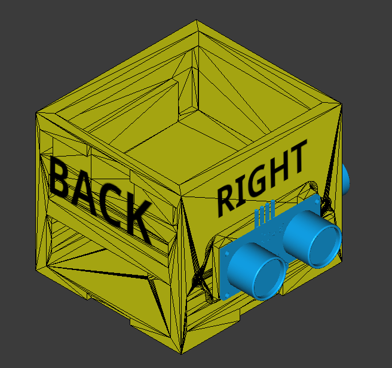
</p>

Now, place the `US sensor chasis` for each sensor:

<p align="center">
  
</p>

#### 7.2. Place the `Battery`

Before placing the battery, remove the connector from the wires and add the `switch` for turning ON and OFF the robot.

**Connector:**

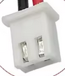

**Switch connection:**

1. Cut the wire
```

```


Then, place the battery 

<p align="center">
  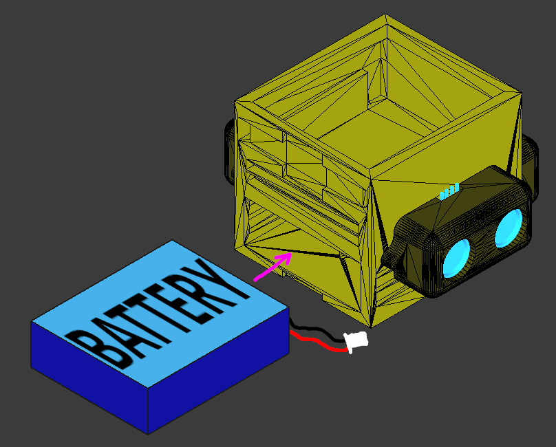
</p>

## 8. Joining upper box with chasis

## 9. Assembling legs (Part 2)