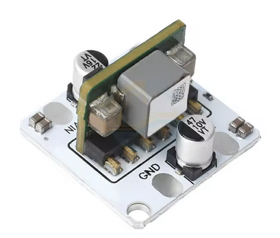

# Battery Selection

The battery of the robot must be chosen so that it satisfies four fundamental requirements:

- **1.** The voltage required by the robot

- **2.** The energy required (capacity in Ah / mAh)

- **3.** The maximum current demanded by the robot

- **4.** The worst-case discharge time

The selected battery is a **3S Li-ion pack (11.1 V, 2.5 Ah, 30 Wh)** with integrated BMS protection.

The selected current regulator is the **“Ultra Small DC-DC 10A Buck Module”**

## Total current required by the system 

- It = ESP32 + HC-SR04(x3) + LED + servos(x8) + PCA9685

## Realistic estimation

We take a conservative estimation for normal operation:

- MG90S: ~1.1 A per servo while moving

- 8 servos

- ESP32 + HC-SR04(x3) + LED + servos(x8) + PCA9685, approximation:

  - It(peak) ≈ 0.3 + 0.015x3 + 0.06 + 1.1 x 8 + 0.025 = 9.23 A 
  - It(continous) ≈ 0.3 + 0.002x3 + 0.06 + 0.4x8 + 0.025 = 3.2868 A

TO DO: Hay que especficar antes los amperajes tanto en cotinuo como en pico de cada componente(mirar disc)

## Required capacity

- qT = It + T

If the target time is, for example, half an hour (t = 0.5h):
	
- qT​(5V) = 9.23⋅0.5 = 4.615Ah = 4615 mAh

## Required voltage

These are these are the components (with the nominal voltage) which will be powered by the battery:

- ESP32 (5 V)
- PCA9685 [servos connected to PCA9685] (5 V)
- HC-SR04 (5 V)

Our battery has to give 5 V

  ## Discharge rate (C)
  - C = Idis / qT
    - Idis = 9.23 A
    - qT = 4.615 Ah 

  The system can demand peaks of approximately **2.0** times the typical current.
  ### Worst-case discharge time

  If we consider the “worst case” as a sustained demand close to the battery’s continuous current rating:

  We know that with the battery selected (3S Li-ion) has a nominal capacity of **2.5 Ah**

  - T_worst_case(peack) = 2.5/9.23 = 0.2709h ≈ **16.3 min**
  - T_worst_case(continuous) = 2.5/3.2868 = 0.7606h ≈ **45.6 min**

# Selected battery

The selected 3S **Li-ion battery (11.1 V, 2.5 Ah, 30 Wh)** was chosen because it satisfies all the electrical, power and autonomy requirements of the robot while remaining compact and lightweight.

## Voltage compatibility

The battery provides a voltage range of 8.0 V to 12.6 V, which is ideal for feeding a DC-DC buck converter. This allows the system to generate a stable 5 V supply for all electronics regardless of the battery’s state of charge.

This avoids the instability that would occur if the servos and electronics were powered directly from the battery.

## Why a DC-DC Buck Converter is used

The robot does not run directly from the 12.6 V battery. Instead, a 5 V, 10 A DC-DC buck converter is used to power all electronics and servos.

### Voltage regulation

All robot components (ESP32, PCA9685, HC-SR04 sensors and MG90S servos) require 5 V.
The battery voltage varies between 12.6 V (fully charged) and 8.0 V (nearly discharged), which would be unsafe for direct connection.

The buck converter provides a stable 5 V output, independent of battery voltage.

### High current capability

The selected buck converter can supply up to 10 A, which is enough to handle:

- High servo currents during motion

- Stall and acceleration peaks

This prevents voltage drops that could reset the ESP32 or destabilize the servos.

	