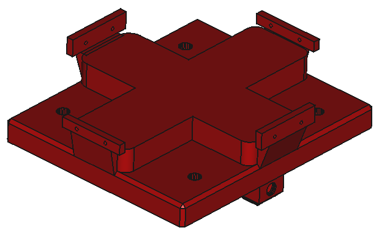
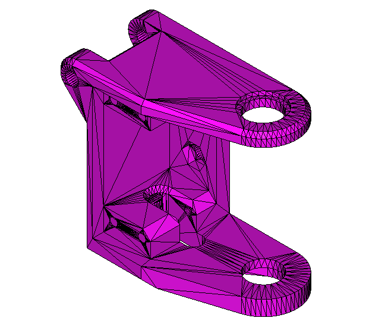
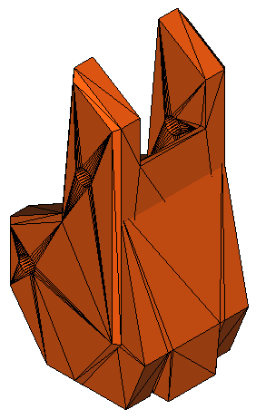
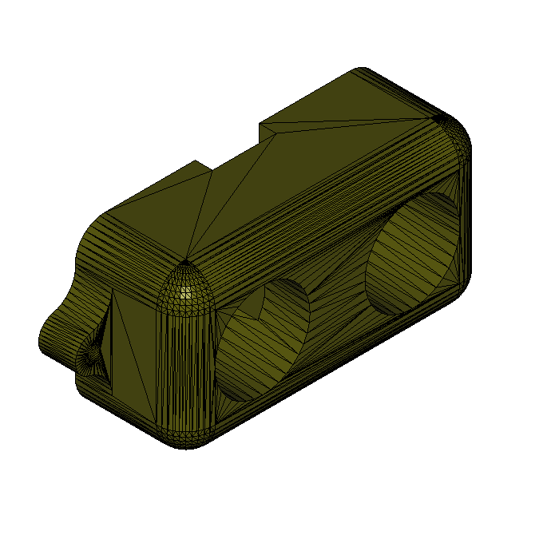
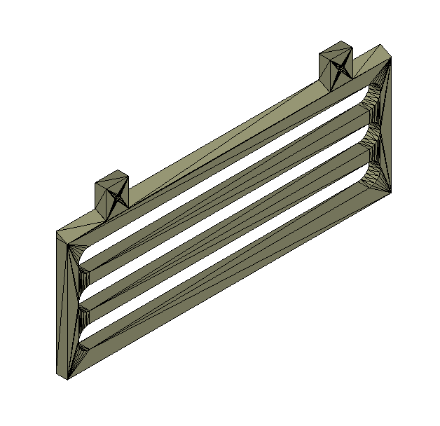
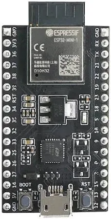
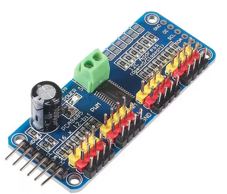
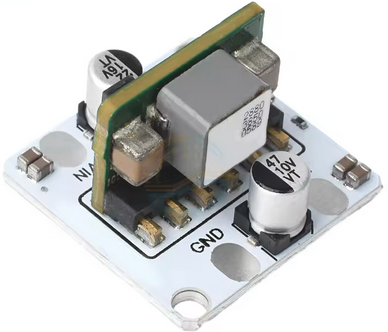
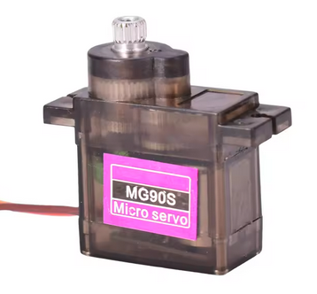
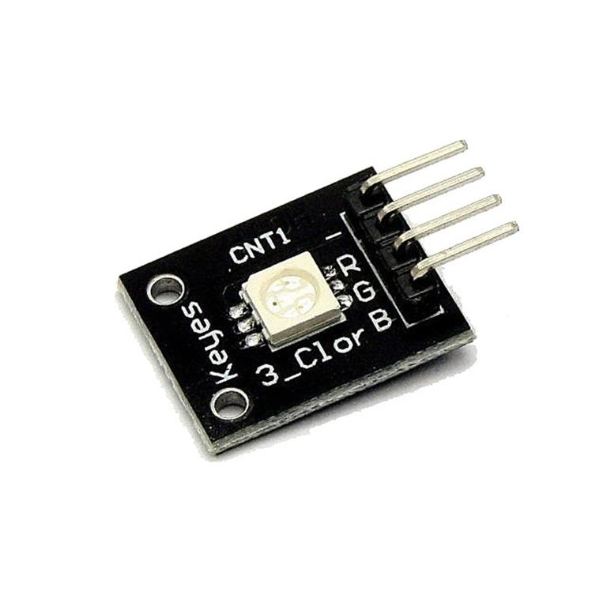

# Materials

## Printable pieces
| Name | Quantity | Mesh | Image |
| :--- | :---: | :---: | ---: |
| `Chasis` | 1 | [chasis_mesh.stl](../meshes/chasis_mesh.stl) |  |
| `Chasis cover` | 1 | [chasis_cover_mesh.stl](../meshes/chasis_cover_mesh.stl) |  |
| `Spacer` (optional) | 4 | [spacer.stl](../meshes/spacer.png) |  |
| `Left shoulder` | 2 | [left_shoulder_mesh.stl](../meshes/left_shoulder_mesh.stl) |  |
| `Right shoulder` | 2 | [right_shoulder_mesh.stl](../meshes/right_shoulder_mesh.stl) |  |
| `Left elbow` | 2 | [left_elbow_mesh.stl](../meshes/left_elbow_mesh.stl) |  |
| `Right elbow` | 2 | [right_elbow_mesh.stl](../meshes/right_elbow_mesh.stl) |  |
| `Leg up link` | 4 | [leg_up_link_mesh.stl](../meshes/leg_up_link_mesh.stl) |  |
| `Foot` | 4 | [foot_fist_mesh.stl](../meshes/foot_fist_mesh.stl) |  | 
| `Box` | 1 | [up_box_mesh.stl](../meshes/up_box_mesh.stl) |  |
| `US Sensor chasis` | 3 | [us_chasis_mesh.stl](../meshes/us_chasis_mesh.stl) |  |
| `Battery limit` | 1 | [battery_limit.stl](../meshes/battery_limit.stl) |  |
| `Weight case` | 1 | [weight_case.stl](../meshes/weight_case.stl) |  |

**Notes:**
- ***Left shoulder/elbow** are for **front left** leg and **back right** leg, while **right shoulder/elbow** are for **front right** leg, **back left** leg.*
- *Spacer is optional as you can replace it for a metalic one with similar dimensions (Inner hole must be at least as the 3D model one).*

## Electronic components
| Name | Quantity | Description | Link | Image |
| :--- | :---: | :---: | :---: | ---: |
| `ESP32` development board | 1 | Dual-Core microcontroller with integrated WiFi and Bluetooth | [Link](https://www.amazon.es/AZDelivery-ESP-32-Dev-Kit-Development/dp/B0DJ33NNRD?) |  |
| `PCA9685` | 1 | 16-channel, I2C-controlled PWM (Pulse Width Modulation) controller. For servos control. | [Link](https://es.aliexpress.com/item/1005005670283526.html) |  |
| `DC-DC Buck module` | 1 | Ultra-small 10A DC-DC Buck Converter 9V-14V to 5V Step-Down Voltage Regulator Module. | [Link](https://es.aliexpress.com/item/1005009068963636.html?) |  |
| `MG90S Servo` | 8 | High-torque, metal-gear micro servo motor. | [Link](https://es.aliexpress.com/item/1005007522665750.html?) |  |
| `Battery` | 1 | 3S1P 18650 Lithium-ion Battery Packs, 12V Rechargeable Lithium Battery.  | [Link](https://es.aliexpress.com/item/1005009656713743.html?) | 
| `HC-SR04` | 3 | Ultrasonic distance sensor | [Link](https://es.aliexpress.com/item/1005010356855481.html?) |  |
| `RGB LED` | 1 | RGB flat led module | Not specified | 

## Cables

## Fasteners
+ 