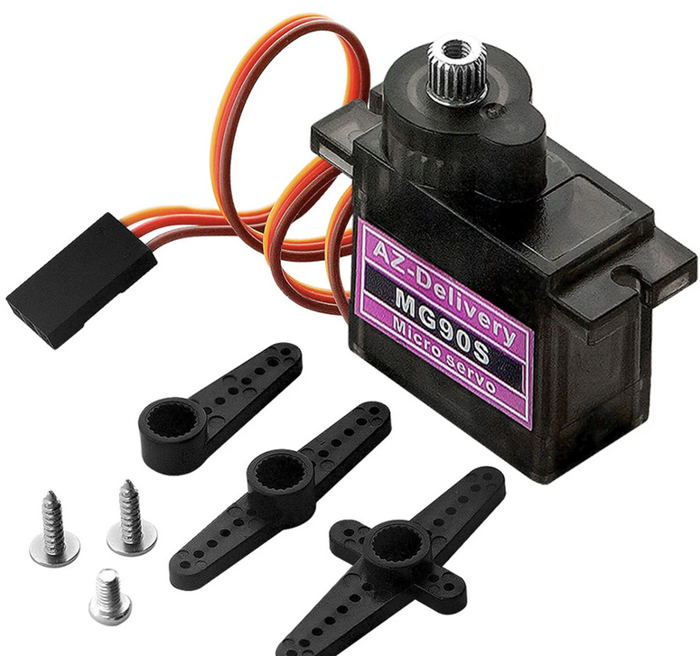

# Servo Selection

The servomotors are one of the most critical components of the robot, as they directly determine its ability to move, support its own weight and manipulate the environment. The selected servos must therefore provide sufficient torque, adequate speed, electrical compatibility and acceptable size and weight.

The robot uses **MG90S** micro servos for all leg joints.

## Selection Objectives

The servos must be capable of:

- Supporting the weight of the **robot** and the **load** during the support phase of walking

- Producing **enough torque** to lift and move the legs

- Moving fast enough to generate a stable and smooth gait

- Operating safely from the **5 V** power system

## Mechanical requirements

During locomotion, not all four legs are always in contact with the ground. Depending on the gait phase, one or two legs may temporarily support most of the robot’s weight. This means that each servo must be dimensioned for loads higher than the static average.

Longer legs and heavier loads increase the required torque, which makes correct servo selection critical.

## Torque capability

The MG90S servo provides a nominal stall torque of approximately **1.86 kg·cm**, which corresponds to:

- 1.86 kg\cm × 0.0980665 = **0.1824 N\m**

This value was used as the maximum available joint torque in the PyBullet simulation:

```cpp
MAX_TORQUE = 0.1824  # N·m
```

During simulation, joint torques were logged while the robot walked and carried load. The measured values remained within the MG90S torque capability, confirming that the servos are able to support both locomotion and payload with an acceptable safety margin.

## Speed capability

The MG90S servo has a typical speed of:

- 0.1 s / 60°

- Equivalent to 600°/s ≈ 10.47 rad/s

This value was also enforced in the simulation:

```cpp
MAX_SERVOS_SPEED = 10.47  # rad/s
```

This ensures that the simulated gait is realistic and achievable by the real servos. The MG90S provides sufficient speed to generate a smooth and stable walking motion without causing excessive inertia or oscillations.

## Electrical compatibility

The MG90S servos operate from 4.8–6 V, which matches the robot’s regulated 5 V power rail generated by the DC-DC buck converter.

